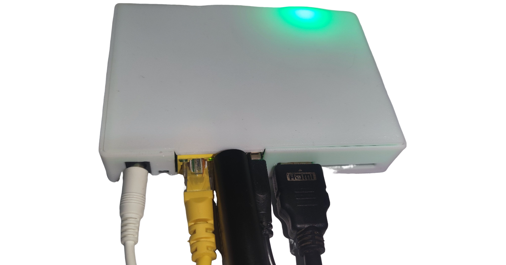

# 玩客云套装使用说明

!!! warning "提醒"
    此页为作者早期出售的玩客云 One-KVM 套装文档，此部分仅作存档使用，内容不再更新。

### **硬件展示**

### 硬件连接

将HDMI转USB采集卡插入玩客云主机网口旁USB口，HDMI视频线插入采集卡HDMI端，USB双公线插入玩客云主机HDMI口旁USB口，插入网线，接入电源。

被控机端，将HDMI视频线和USB双公线接入对应接口即可。

!!! warning 提醒
    玩客云USB设备插反会导致PiKVM所有远控功能无法使用。

!!! tip
    部分低功耗设备在未接通电源时可能通过USB双公线从玩客云取电并启动至异常状态，再接通电源也无法启动。要解决此问题，您可以剥开USB双公线剪断红色5V细电线。

!!! tip
    初始WEB和VNC账号密码都为admin/admin且同步，root用户密码通常为用户自行设置，若未设置可尝试1234。 ssh默认端口：22 web默认端口：80，443 vnc默认端口：5900 janus ws端口(默认关闭)：5009

!!! tip
    排障指南： 网页视频黑屏提示无No Singal，请检查硬件是否正确连接或松动； 网页端黑屏无任何画面或彩色竖条，请检查是否有被控机HDMI信号输入； 进系统画面显示正常，bios界面黑屏或渲染异常，请尝试在BIOS界面开启CMS兼容模式； 虚拟鼠标错位或移动范围异常可尝试在网页右上角切换鼠标相对模式； 画面显示片刻黑屏，刷新网页重复此现象，可以尝试使用火狐浏览器； 如果以上情况都不符合请尝试重启玩客云自动复位，仍旧无法解决可在Github提issue或加入One-KVM交流群反馈。

### MSD

Mass Storage Drive，即大容量储存设备，可以实现远程上传文件，挂载镜像等功能。由于Linux限制，CD-ROM格式大小最大为2.2G，FALSH格式大小无限制。

!!! warning
    请不要在USB双公线（OTG线）与被控机断开或被控机关机时使用解除镜像挂载功能（ 断开连接），否则会因USB OTG 端口操作不可用致使内核疯狂持续报错，日志服务占用CPU 100%，系统稳定性下降。这时除非USB OTG连接恢复正常，MSD功能会一直保持不可用状态。

### ATX电源控制

如果要使用ATX控制物理开关机功能请连接好开机线（**目前成品深色引出线接9pin中的开机负极，浅色引出线接开机针脚正极，如黑白、褐红，橙黄对应负极和正极**），延长线不分颜色直接使用。

