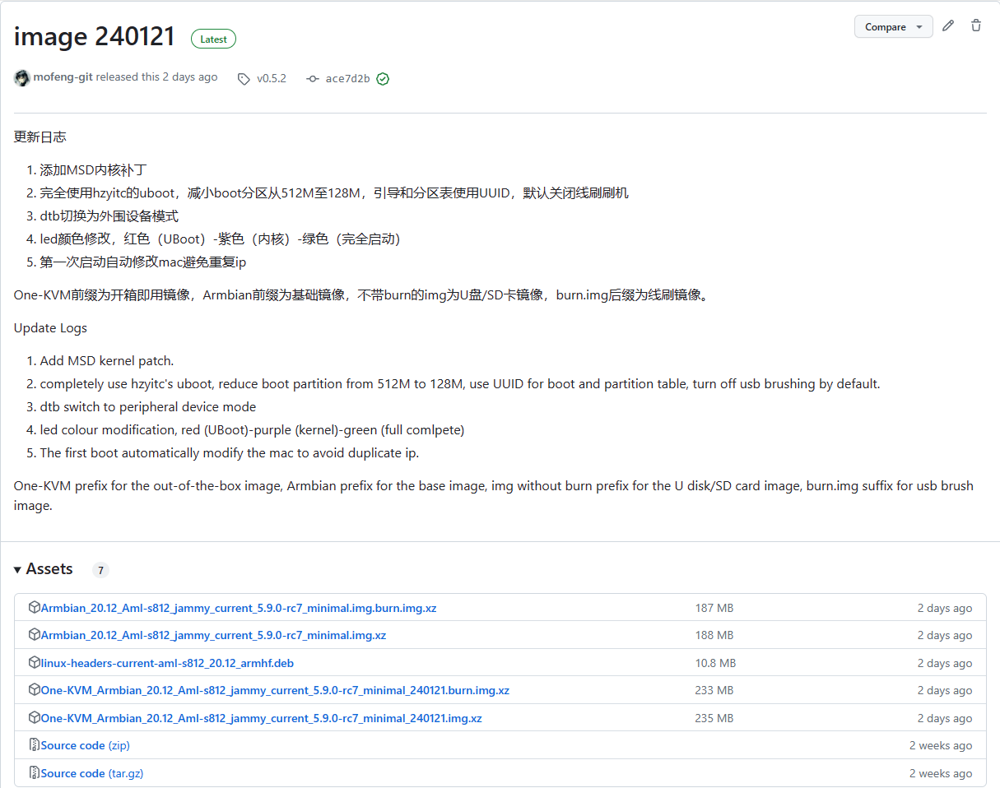

# 玩客云DIY安装

### 硬件清单

必备硬件：玩客云（含电源和USB刷机线），HDMI转USB采集卡（推荐MS2109方案），8芯网线和HDMI线

可选硬件：TF卡（扩展储存） TTL转USB适配器（调试工具）

**镜像及工具文件**

中国移动云盘（需登录不限速）：[https://caiyun.139.com/m/i?185C7G0jdgI3A](https://caiyun.139.com/m/i?185C7G0jdgI3A) 提取码:61Br

百度网盘（需登录）：[https://pan.baidu.com/s/166-2Y8PBF4SbHXFkGmFJYg?pwd=o9a](https://pan.baidu.com/s/166-2Y8PBF4SbHXFkGmFJYg?pwd=o9a)j 

OneIndex（免登录不限速）：[https://files.mofeng.run/](https://files.mofeng.run/)

| **采集卡硬件兼容性列表（仅列出部分）** |             |               |               |              |
| :------------------------------------: | :---------: | :-----------: | :-----------: | :----------: |
|             **型号/方案**              | **USB接口** | **Linux支持** | **PiKVM支持** | **使用情况** |
|                 MS2109                 |   USB2.0    |       √       |       √       |     推荐     |
|                 MS2130                 |   USB3.0    |       √       |       √       |   配置过剩   |
|                 MS2131                 |   USB3.0    |       √       |       √       |   配置过剩   |
|              腾飞 TFDGK05              |   USB2.0    |       √       |       ×       |      /       |
|            迈拓矩阵 MT-UH02            |   USB2.0    |       ×       |       ×       |      /       |

### 方式一：直刷One-KVM镜像

带burn后缀的为线刷镜像，可使用USB_Burning_Tool线刷至玩客云。不带burn后缀的为U盘/SD卡启动镜像，直接写入U盘/SD卡即可。镜像为开箱即用，刷好后启动设备就可以开始使用One-KVM。


提示：若原系统为玩客云原厂系统，建议先线刷UBoot（底包）再线刷此固件，成功率更高。

Amlogic USB Burning Tool建议使用 v2.1.3及以下版本，不要使用高版本软件。

刷机短接时不需要一直短接，在烧录软件识别到并加载到1%可以松手耐心等待刷机成功了。

玩客云主板刷机短接图片来源于玩客云技术交流群 蓝蓝大佬。

**注意**：最新镜像不代表最稳定，反而可能存在诸多问题，这里列出的是经过大量测试最适合实际使用的镜像版本（类似LTS版本）。若想体验最新特性和最新功能、不在意稳定性时可以使用最新发布版本。

**当前稳定镜像版本：image 240318**

网盘路径：/玩客云/OneKVM开箱即用固件/

**上一个稳定镜像版本：image 240121**

网盘路径：/玩客云/OneKVM开箱即用固件/历史镜像/240121/




### 方式二：**脚本安装**

一键脚本，对于非玩客云设备安装未作测试，适用于玩客云Armbian Jammy系统。

```Bash
git clone https://github.com/mofeng-git/One-KVM.git
cd One-KVM  && ./install.sh

#对于大陆网络环境，可以尝试使用下命令
wget https://mirror.ghproxy.com/https://github.com/mofeng-git/One-KVM/archive/refs/heads/main.zip -o One-KVM-main.zip && unzip One-KVM-main.zip
cd One-KVM-main  && ./install.sh
```

