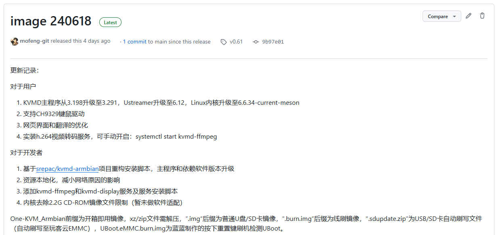
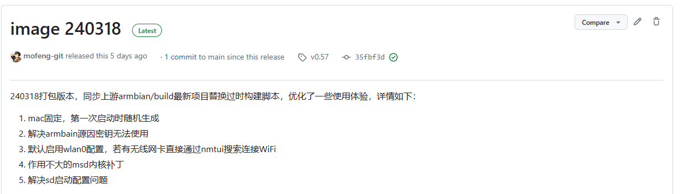

# 玩客云 DIY 安装

### 硬件清单

必备硬件：玩客云（含电源和 USB 刷机线），HDMI 转 USB 采集卡（推荐 MS2109 方案），8芯网线和 HDMI 线

可选硬件：TF 卡（扩展储存）、 TTL 转 USB 适配器（调试工具）

**镜像及工具文件**

中国移动云盘（需登录不限速）：[https://caiyun.139.com/m/i?185C7G0jdgI3A](https://caiyun.139.com/m/i?185C7G0jdgI3A) 提取码:61Br

百度网盘（需登录）：[https://pan.baidu.com/s/166-2Y8PBF4SbHXFkGmFJYg?pwd=o9a](https://pan.baidu.com/s/166-2Y8PBF4SbHXFkGmFJYg?pwd=o9a)j 

OneIndex（免登录不限速）：[https://files.mofeng.run/](https://files.mofeng.run/)

| **采集卡硬件兼容性列表（仅列出部分）** |              |                |                |              |
| :------------------------------------: | :----------: | :------------: | :------------: | :----------: |
|             **型号/方案**              | **USB 接口** | **Linux 支持** | **PiKVM 支持** | **使用情况** |
|                 MS2109                 |    USB2.0    |       √        |       √        |     推荐     |
|                 MS2130                 |    USB3.0    |       √        |       √        |   配置过剩   |
|                 MS2131                 |    USB3.0    |       √        |       √        |   配置过剩   |
|              腾飞 TFDGK05              |    USB2.0    |       √        |       ×        |      /       |
|            迈拓矩阵 MT-UH02            |    USB2.0    |       ×        |       ×        |      /       |

### 方式一：直刷 One-KVM 镜像

带 burn 后缀的为线刷镜像，可使用 USB_Burning_Tool 晶晨刷机软件线刷至玩客云。不带 burn 后缀的为 U 盘/ SD 卡启动镜像，直接写入 U 盘/ SD 卡即可。镜像为开箱即用，刷好后启动设备就可以开始使用 One-KVM。


Amlogic USB Burning Tool 建议使用 v2.1.3 及以下版本，不要使用高版本软件。

刷机短接时不需要一直短接，在烧录软件识别到并加载到 1% 可以松手耐心等待刷机成功了。

玩客云主板刷机短接图片来源于玩客云技术交流群 蓝蓝大佬。

**注意**：最新镜像不代表最稳定，反而可能存在诸多问题，稳定版是经过大量测试最适合实际使用的镜像版本（类似LTS版本）。若想体验最新特性和最新功能、不在意稳定性时可以使用最新发布版本。

**当前最新镜像版本：image 240618**

网盘路径：/玩客云/OneKVM开箱即用固件/

**当前稳定镜像版本：image 240318**

网盘路径：/玩客云/OneKVM开箱即用固件/历史镜像/240318/





### 方式二：**脚本安装**

一键脚本，对于非玩客云设备安装未作测试，适用于玩客云Armbian Jammy系统。

```Bash
git clone https://github.com/mofeng-git/One-KVM.git
cd One-KVM
bash ll.sh
```

