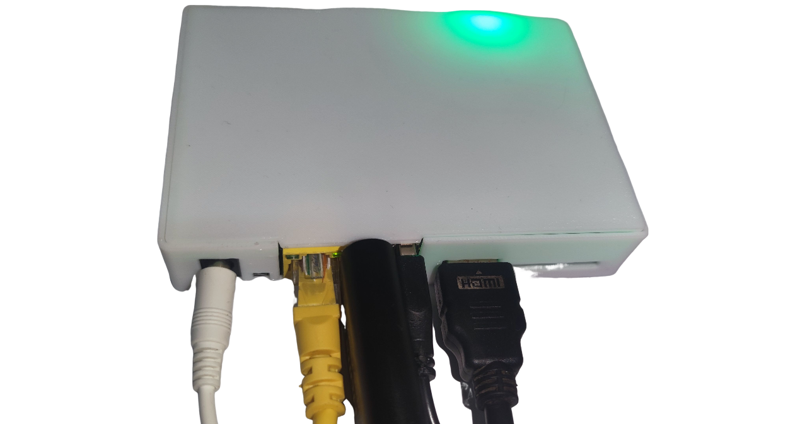

### 硬件准备

必备硬件：玩客云主机、USB HDMI 采集卡、普通 USB 双公线

可选硬件：TF 卡（扩展储存）、 TTL 转 USB 适配器（调试工具）

### 整合包部署

**刷机包选择**

- 线刷镜像（带 burn 后缀）：适用于通过 Amlogic USB Burning Tool 进行固件更新。推荐使用 v2.1.3 或更低版本的刷机软件。
- U 盘/SD 卡启动镜像：适合直接写入到 U 盘或 SD 卡中启动设备。

**视频教程参考**

详细过程可以参考 B站UP主 夏秋BH6RRB 的视频教程。

<iframe height="400" width="600" src="//player.bilibili.com/player.html?isOutside=true&aid=113310901083506&bvid=BV1Hz2ZYxEr8&cid=26301303868&p=1" scrolling="no" border="0" frameborder="no" framespacing="0" allowfullscreen="true"></iframe>

**其他刷机事项**

刷机短接时不需要一直短接，在烧录软件识别到并加载到 1% 可以松手耐心等待刷机成功了。玩客云主板刷机短接图片来源于玩客云技术交流群 蓝蓝大佬。

玩客云刷入直刷镜像后默认上网方式为 DHCP 自动获取 IP，主机名为 `onecloud`。启动时由玩客云前面板LED灯会有红灯转为绿灯，启动后在浏览器访问玩客云IP即可。

若还需要刷机，不需要再次进行短接了，可以按住重置键通电进入刷机模式。

### 使用说明

**硬件连接**

1. 将 HDMI 转 USB 采集卡插入玩客云主机靠近网口的 USB 插槽，使用 HDMI 视频线连接采集卡与被控机器的 HDMI 输出端。
2. 将 USB 双公线的一端插入玩客云主机 HDMI 接口旁边的 USB 插槽，另一端连接至被控机器相应的 USB 接口。
3. 确保所有连接稳固，接入电源及网线。

!!! tip "提醒"
    部分低功耗设备在未接通电源时可能通过 USB 双公线从玩客云 OTG 口取电并启动至异常状态，再接通电源也无法启动。要解决此问题，您可以剥开 USB双 公线剪断红色 5V 细电线。

**SSH 远程登录**

Armbian 系统默认开启 SSH 服务，初始用户密码为 root/1234。请尽快更改默认密码以增强安全性。

!!! warning "警告"
    不建议使用 `apt upgrade` 升级内核和设备树，可能会出现系统异常，OTG 功能无法使用。

**ATX 电源控制**

如果要使用ATX控制物理开关机功能请连接好开机线。

