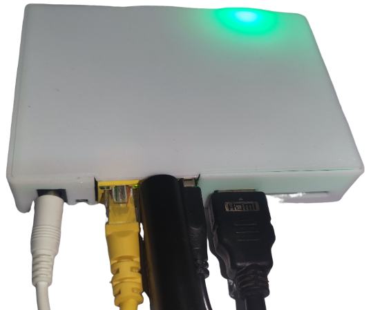

### 硬件说明

必备硬件：玩客云主机，USB HDMI 采集卡

可选硬件：TF 卡（扩展储存）、 TTL 转 USB 适配器（调试工具）

### Docker 部署

待更新。

### 整合包部署

带 burn 后缀的为线刷镜像，可使用 USB_Burning_Tool 晶晨刷机软件线刷至玩客云。不带 burn 后缀的为 U 盘/ SD 卡启动镜像，直接写入 U 盘/ SD 卡即可。镜像为开箱即用，刷好后启动设备就可以开始使用 One-KVM。

Amlogic USB Burning Tool 建议使用 v2.1.3 及以下版本，不建议使用高版本软件。刷机短接时不需要一直短接，在烧录软件识别到并加载到 1% 可以松手耐心等待刷机成功了。玩客云主板刷机短接图片来源于玩客云技术交流群 蓝蓝大佬。

玩客云刷入直刷镜像后默认上网方式为 DHCP 自动获取 IP，主机名为 `onecloud`。启动时由玩客云前面板LED灯会有红灯转为绿灯，启动后在浏览器访问玩客云IP即可。

### 使用说明

**硬件连接**

将HDMI转USB采集卡插入玩客云主机网口旁USB口，HDMI视频线插入采集卡HDMI端，USB双公线插入玩客云主机HDMI口旁USB口，插入网线，接入电源。被控机上将HDMI视频线和USB双公线接入对应接口即可。

!!! warning 提醒
    玩客云USB设备插反会导致PiKVM所有远控功能无法使用。

!!! tip
    部分低功耗设备在未接通电源时可能通过 USB 双公线从玩客云 OTG 口取电并启动至异常状态，再接通电源也无法启动。要解决此问题，您可以剥开 USB双 公线剪断红色 5V 细电线。

**SSH**

Armbian 系统默认开启 SSH，SSH 初始用户密码为 root/1234。

### ATX电源控制

如果要使用ATX控制物理开关机功能请连接好开机线。

