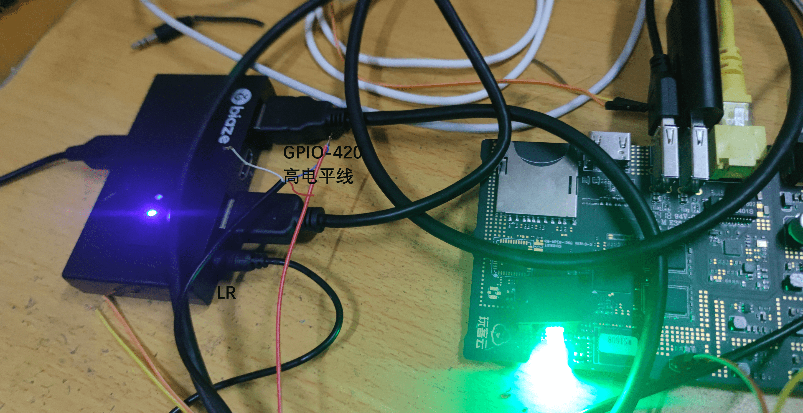

# 实现One-KVM一控多

!!! warning
    此为实验性功能，仅通过初步测试，不保证完全可用。

通过玩客云GPIO控制KVM切换器切换显示，实现One-KVM一控多。

硬件要求：需要使用支持lr（音频口/红外口）控制的KVM切换器，接入音频线。

简要方法：将音频线剥开并测量对应电压，将高电平的一根线材与玩客云GPIO-420相连，即可通过网页的ATX电源管理菜单触发GPIO-420电平变化控制KVM切换器，从而实现通过One-KVM网页管理的一控多用途。

