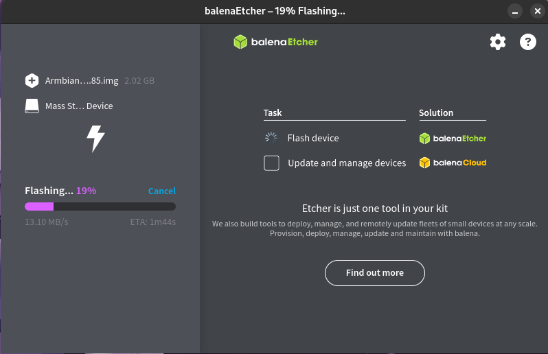

### 硬件介绍

Orange Pi Zero 采用了全志四核A7高性能处理器Allwinner H2/H3+，集成百兆板载网口、板载 WIFI、板载存储、USB OTG供电、USB2.0端口等。

说明：香橙派 zero 供电和 OTG 数据传输为同一个 microusb 接口，推荐使用数据供电分离一分二的 USB 线材。

### Docker 部署

第一步是把下载好的 Armbian 镜像写入 SD 卡。

这里使用 `Armbian_23.02.0-trunk_Orangepizero_jammy_current_5.15.85_msd-patched.img` 作为基础系统，并使用 Docker 部署 On-KVM。Armbian 镜像下载地址：[Armbian_23.02.0-trunk_Orangepizero_jammy_current_5.15.85_msd-patched.zip](https://github.com/jacobbar/fruity-pikvm/releases/download/os-images/Armbian_23.02.0-trunk_Orangepizero_jammy_current_5.15.85_msd-patched.zip)



进入系统后执行下列命令即可完成 One-KVM Docker 版的安装。

```
#清除 g_serial 内核模块自动挂载
echo "" > /etc/modules-load.d/modules.conf

#Docker 部署 One-KVM
apt update
apt install docker.io
docker run --name kvmd -itd --privileged=true \
    -v /dev:/dev -v /sys/kernel/config:/sys/kernel/config \
    -v /lib/modules:/lib/modules:ro -e OTG=1 \
    -p 8080:8080 -p 4430:4430 -p 5900:5900 -p 623:623 \
    silentwind0/kvmd
#确认容器正常运行后可添加自动重启
docker update --restart=always kvmd
```

运行效果如下。


### 其他

!!! tip
    如果使用数据供电一分二 USB 线材，部分低功耗设备在未接通电源时可能从 USB 取电并启动至异常状态，再接通电源也无法启动。要解决此问题，您可以剥开 USB 数据线剪断红色 5V 细电线。

**SSH**

Armbian 系统默认开启 SSH，SSH 初始用户密码为 root/1234。如使用香橙派官方系统，默认用户密码为 root/orangepi。

**WIFI 连接**

要连接到 2.4G WIFI，执行以下命令即可进入命令行图形界面连接额。

```
nmtui
```

