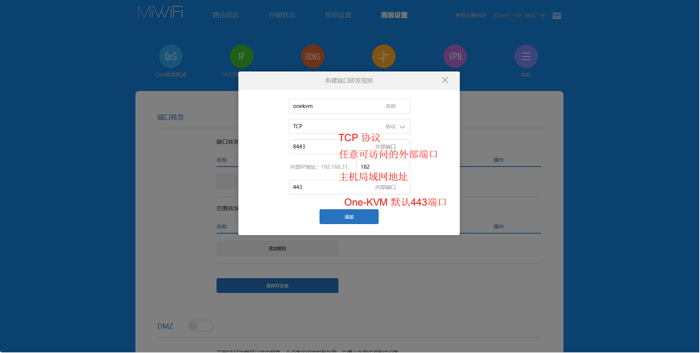

如果需要从互联网访问 PiKVM，最简单的方法是在路由器上设置转发端口。在这种情况下，需要运营商给路由器分配了公网 IPv4 或公网 IPv6 地址。

### 端口转发配置

!!! tip
    要配置端口转发将 One-KVM 服务暴露到公网上时，强烈建议您设置强密码并启用双因素授权避免未授权访问。 
    如果没有公网 IP 地址，可以尝试使用 Frp 、 Tailscale 等软件进行端口映射或异地组网。

Web UI 的监听端口为 (HTTP 80) 和 (HTTPS 443)，默认情况下，80端口会自动重定向到443端口。大多数情况下，转发443端口就足够了，如果还需要使用 VNC 服务的则需要再转发5900端口。

这是在小米路由器管理后台新建端口转发的简单示例。

