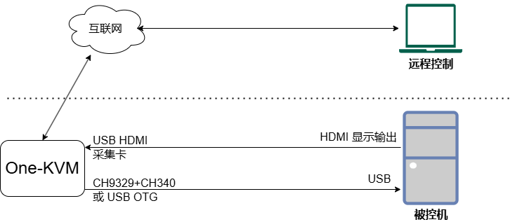
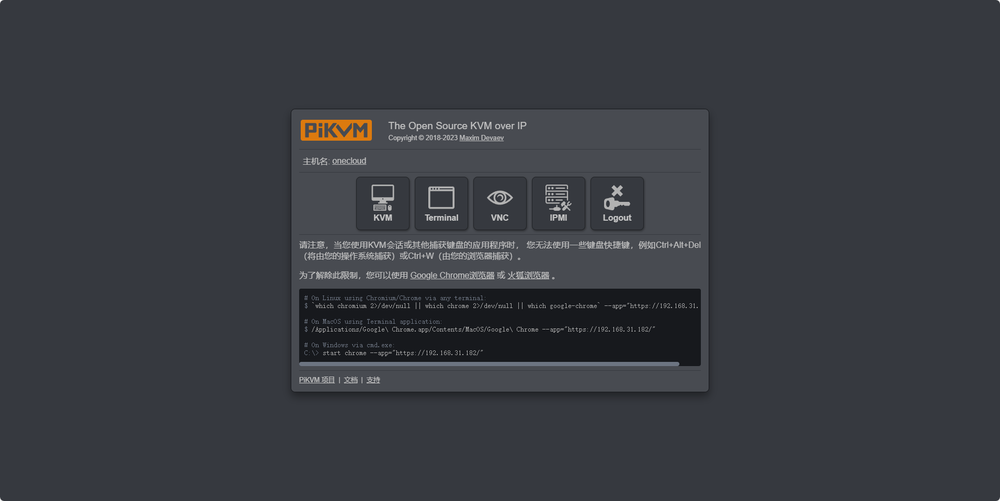
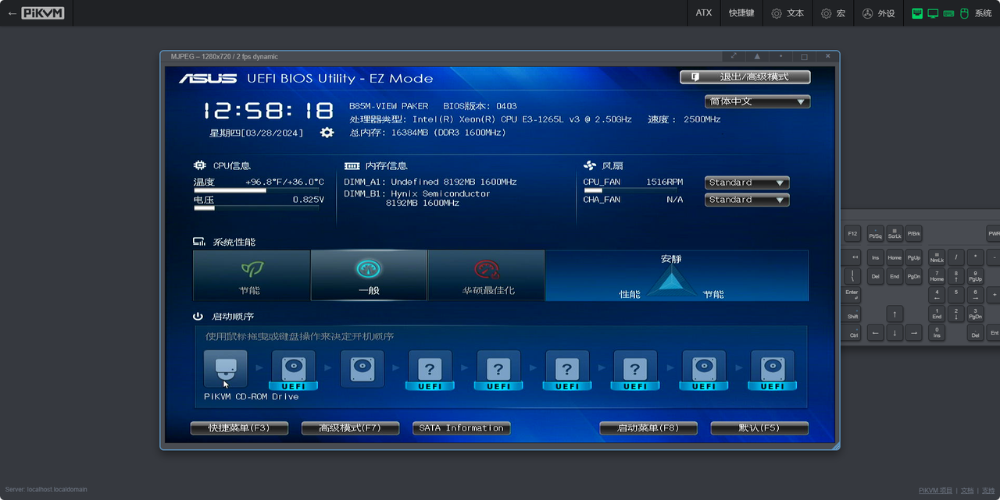
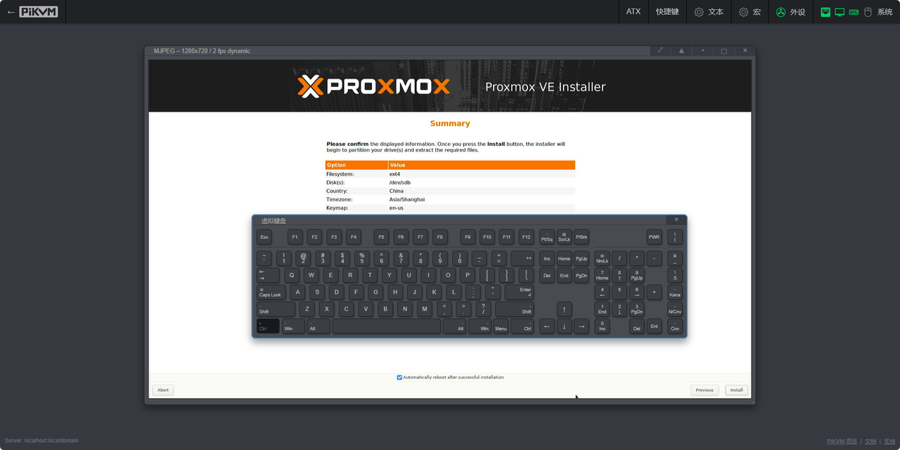
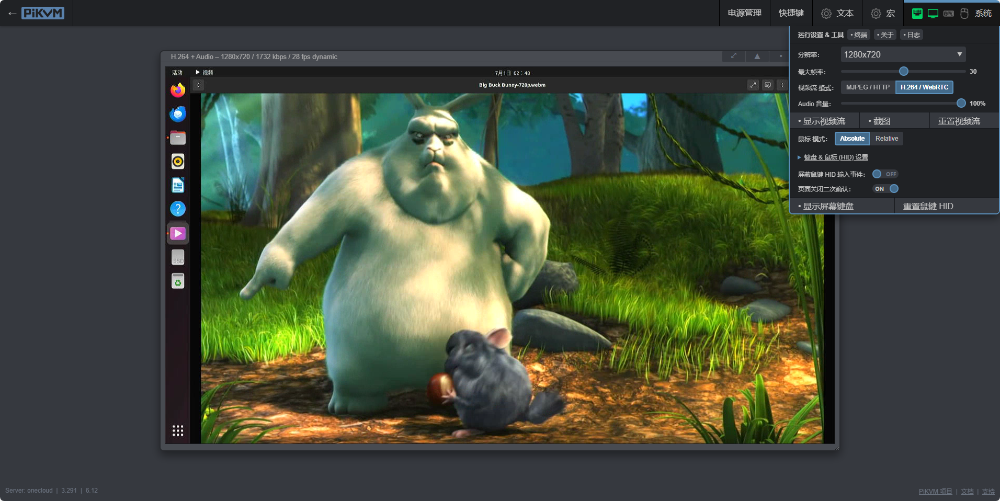
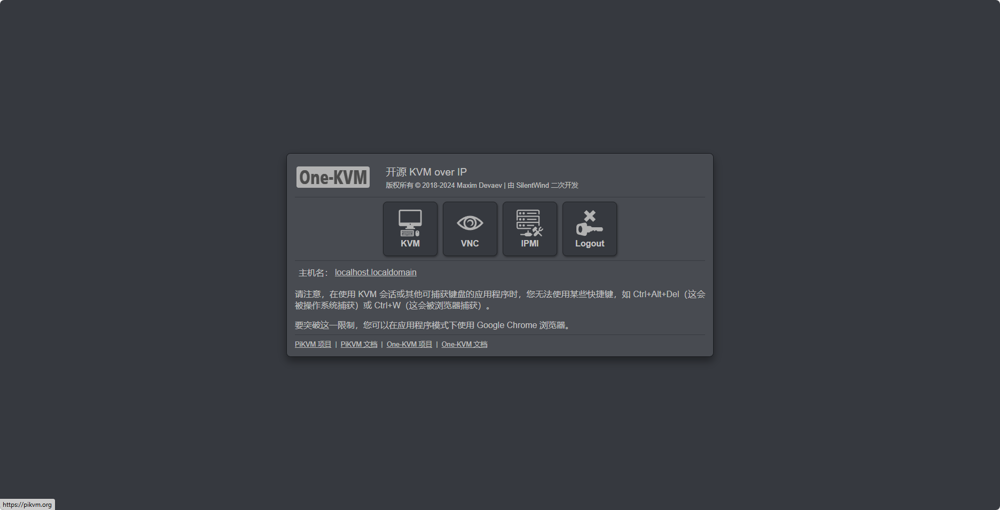
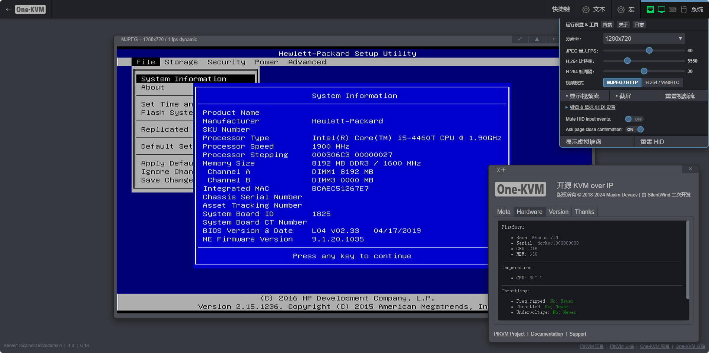

### 工作原理

### 软件功能

表格仅为 One-KVM 与其他基于 PiKVM 的项目的功能对比，无不良导向，如有错漏请联系更正。

|         功能          |     One-KVM     |           PiKVM           |   ArmKVM    |   BLIKVM    |
| :-------------------: | :-------------: | :-----------------------: | :---------: | :---------: |
|       系统开源        |        √        |             √             |      √      |      √      |
|    简体中文 WebUI     |        √        |             x             |      √      |      √      |
|      远程视频流       |   MJPEG/H.264   |        MJPEG/H.264        | MJPEG/H.264 | MJPEG/H.264 |
|    H.264 视频编码     |       CPU       |            GPU            |    未知     |     GPU     |
|      远程音频流       |        √        |             √             |      √      |      √      |
|   远程鼠键控制        |   OTG/CH9329    | OTG/CH9329/Pico/Bluetooth |     OTG     |     OTG     |
|       VNC 控制        |        √        |             √             |      √      |      √      |
|     ATX 电源控制      | GPIO/USB 继电器 |           GPIO            |    GPIO     |    GPIO     |
| 虚拟存储驱动器挂载     |        √        |             √             |      √      |      √      |
| 2.2G 以上 CD-ROM 挂载 |        x        |             x             |      √      |      √      |
|     WOL 远程唤醒      |        √        |             √             |      √      |      √      |
|      网页剪切板       |        √        |             √             |      √      |      √      |
|     OCR 文字识别      |        √        |             √             |      √      |      √      |
|       网页终端        |        √        |             √             |      √      |      √      |
|     网络串口终端      |        x        |             x             |      √      |      √      |
|    HDMI 切换器支持    |        √        |             √             |      √      |      √      |
|       视频录制        |        √        |             x             |      x      |      x      |
|      Docker 部署      |        √        |             x             |      x      |      x      |
|    官方商业化成品     |        x        |             √             |      √      |      √      |
|       技术支持        |        √        |             √             |      √      |      √      |

### 支持平台

- 架构：x86_64、ARMv7、ARM64
- 平台：Docker
- 硬件：USB UVC 采集卡、CH9329+CH340 或 OTG 端口

| 整合包适配概况 | (点击型号蓝字可查看详情) | | | |
| :-------------: | :-------------: | :-------------: | :-------------: | :-------------: |
| **固件型号** | **固件代号** | **硬件情况** | **最新版本** | **维护状态** |
| [玩客云](start_install/onecloud_install.md) | Onecloud | USB 采集卡、OTG | 241214 | 持续更新 |
| [私家云二代](start_install/cumebox2_install.md) | Cumebox2 | USB 采集卡、OTG | 241214 | 持续更新 |
| [Vmare](start_install/virtualmachine_install.md) | Vmare-uefi | USB 采集卡、CH9329 | 241214 | 持续更新 |
| [Virtualbox](start_install/virtualmachine_install.md) | Virtualbox-uefi | USB 采集卡、CH9329 | 241214 | 持续更新 |
| [s905l3a  通用包](start_install/s905l3a_install.md) | E900v22c | USB 采集卡、OTG | 241214 | 持续更新 |
| [我家云](start_install/chainedbox_install.md) | Chainedbox | USB 采集卡、OTG | 241214 | 持续更新 |
| [龙芯久久派](start_install/2k0300_install.md) | 2k0300 | USB 采集卡、CH9329 | 241025 | 停止更新 |

| USB 采集卡硬件兼容性 |              |                |                |              |
| :------------------------------------: | :----------: | :------------: | :------------: | :----------: |
|             **型号/方案**              | **USB 接口** | **Linux 支持** | **One-KVM 支持** | **使用情况** |
|                 MS2109                 |    USB2.0    |       √        |       √        |     推荐     |
|                 MS2130                 |    USB3.0    |       √        |       √        |   推荐   |
|                 MS2131                 |    USB3.0    |       √        |       √        |   推荐   |
|              腾飞 TFDGK05              |    USB2.0    |       √        |       ×        |      /       |
|            迈拓矩阵 MT-UH02            |    USB2.0    |       ×        |       ×        |      /       |

### 文件下载

huang1111网盘（免登录高速下载）：[https://webdav.huang1111.cn/s/e0Yfl](https://webdav.huang1111.cn/s/e0Yfl)

百度网盘（需登录）：[https://pan.baidu.com/s/166-2Y8PBF4SbHXFkGmFJYg?pwd=o9a](https://pan.baidu.com/s/166-2Y8PBF4SbHXFkGmFJYg?pwd=o9aj) 

<!-- 截图大同小异，取消展示各个硬件，移动至各自页面  
**玩客云**

**群晖 x86_64**

**私家云二代**

更多平台无法一一列举。
-->