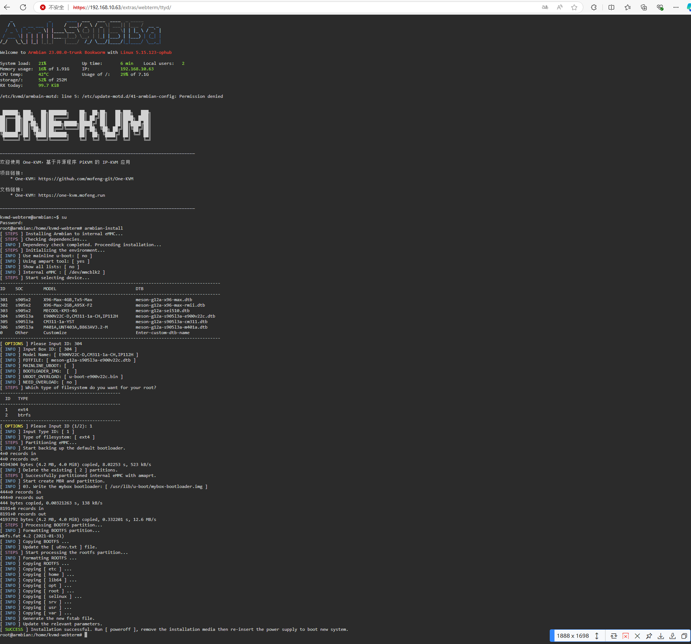

### 硬件说明


s905l3a One-KVM 整合包在中兴 B863AV3.2M 和 CM311-1a-CH 通过测试。

`armbian-install` 安装可选型号：
```
--------------------------------------------------------------------------------------
ID    SOC        MODEL                               DTB                                               
--------------------------------------------------------------------------------------
301   s905x2     X96-Max-4GB,Tx5-Max                 meson-g12a-x96-max.dtb                            
302   s905x2     X96-Max-2GB,A95X-F2                 meson-g12a-x96-max-rmii.dtb                       
303   s905x2     MECOOL-KM3-4G                       meson-g12a-sei510.dtb                             
304   s905l3a    E900V22C-D,CM311-1a-CH,IP112H       meson-g12a-s905l3a-e900v22c.dtb                   
305   s905l3a    CM311-1a-YST                        meson-g12a-s905l3a-cm311.dtb                      
306   s905l3a    M401A,UNT403A,B863AV3.2-M           meson-g12a-s905l3a-m401a.dtb                      
0     Other      Customize                           Enter-custom-dtb-name                             
--------------------------------------------------------------------------------------
```

### 整合包部署

大致流程：

- 通电开机进入 android tv，ROOT 后安装 apk 切换到外部（U 盘/TF 卡）引导

- 将整合包写入 U 盘/TF 卡上，盒子重启开机后进入 U 盘/TF 卡上的 armbian 系统

- 用 `armbian-install` 命令选择对应型号把 One-KVM 的固件 img 写入 emmc

安装示例：


### Docker 部署

大致流程：

- 为机顶盒刷入安卓系统，安卓系统 ROOT 后安装切换卡载系统 apk
- 为优盘刷入可启动的 armbian 系统，优盘接入机顶盒，在安卓系统下切换至卡载系统
- 执行 `armbian-install` 命令将卡载系统刷写入 EMMC
- 拔出优盘重启机顶盒，换源，安装 Docker 软件
- 在 Docker 中部署 kvmd 镜像
```bash
#运行 kvmd 容器
sudo docker run -name kvmd -itd --privileged=true
    -v /lib/modules:/lib/modules:ro -v /dev:/dev
    -v /sys/kernel/config:/sys/kernel/config -e OTG=1 -e VIDEONUM=1 \
    -p 8080:8080 -p 4430:4430 -p 5900:5900 -p 623:623 \
    registry.cn-hangzhou.aliyuncs.com/silentwind/kvmd

#使能 OTG device 模式
sudo echo device > /sys/class/usb role/ffe09000.usb-role-switch/role
#将 OTG 端口使能命令写入开机启动脚本 /etc/rc.local
sudo nano /etc/rc.local
#添加脚本执行权限
sudo chmod +x /etc/rc.local

#确认容器正常运行后，设置 Docker 自启动，容器 kvmd 自启动
sudo systemctl enable docker
sudo docker update --restart=always kvmd
```