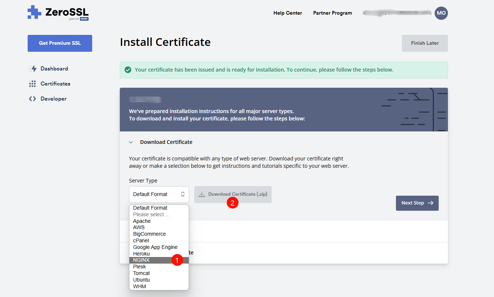
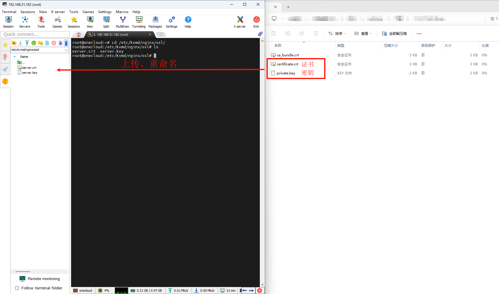

### 更换 SSL 证书

SSL 证书密钥放置在 /etc/kvmd/nginx/ssl/ 目录下，默认为 One-KVM 安装时生成的自签证书，不受浏览器信任。如果需要使用自己的证书，请替换 /etc/kvmd/nginx/ssl/中的密钥和证书并重新启动kvmd-nginx服务。

这是安装 ZeroSSL SSL证书的简单示例。

首先添加域名或 IP 并完成域名或  IP 验证，然后下载 NGINX 格式的 SSL 证书。



然后将下载的 SSL 证书和私钥重命名为”server“+后缀名，上传至 One-KVM 主机 /etc/kvmd/nginx/ssl/ 目录下，最后重启 kvmd-nginx 使新的 SSL 证书生效。

```bash
systemctl restart kvmd-nginx
```

