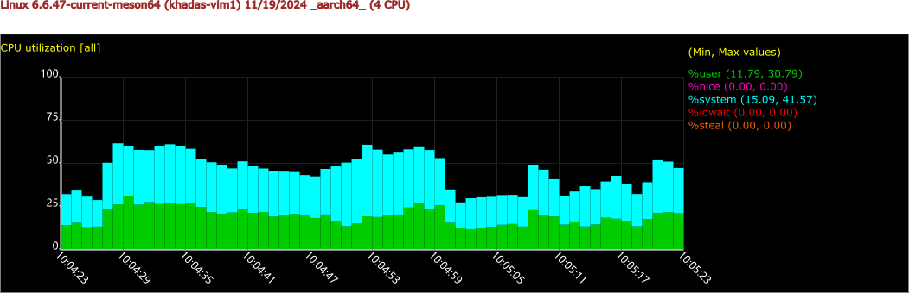
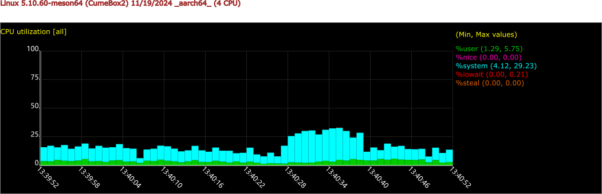
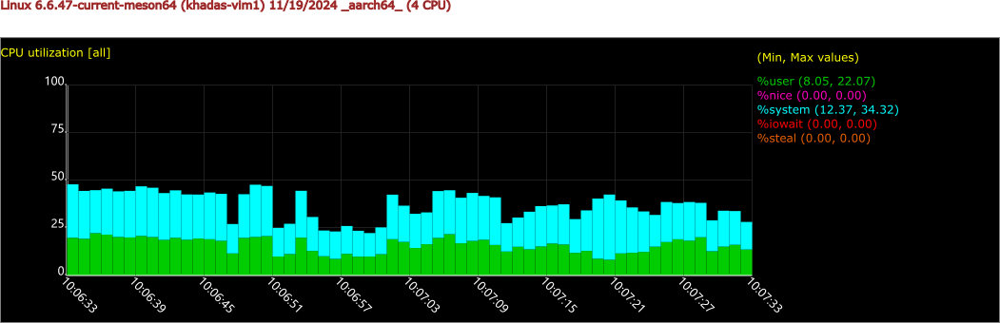
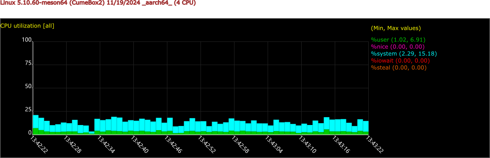
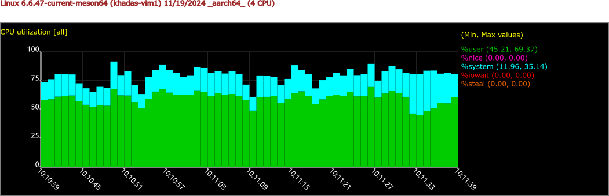
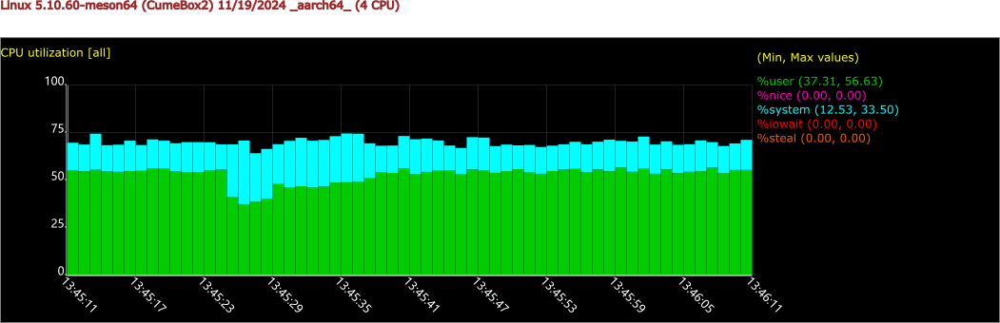

结论：Docker 安装 One-KVM 相比实机安装 One-KVM 无性能落后，且由于自身服务依赖高度精简的特性 CPU 占用略胜一筹。

### 测试方法
```
#被控机循环播放 1080p 视频
#使用如下测试命令，统计 CPU 占用并生成图表
apt-get install sysstat
sar -u 1 60 -o tmp1
sadf -T  -g ./tmp1  --  > test1.svg
```

### 测试结果

**1080p30fps mjpeg/http** 

实机安装 One-KVM（实际跑满）



Docker 安装 One-KVM（实际跑满）



**720p60fps mjpeg/http**

实机安装 One-KVM（实际稳定在48fps）



Docker 安装 One-KVM（实际稳定在48fps）



**720p30fps h.264/webrtc**

实机安装 One-KVM（实际跑满，偶有波动）



Docker 安装 One-KVM（实际跑满，偶有波动）

