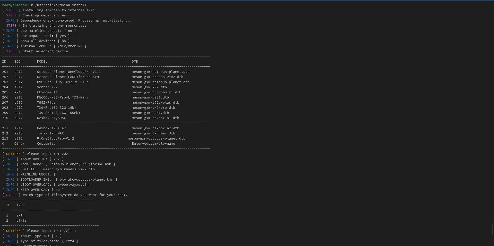
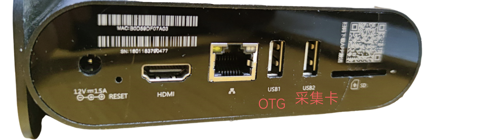

### 硬件介绍

章鱼星球盒子采用了 S912 八核 CPU，搭配 2GB 内存和 8GB 内部储存空间。它配备了一个千兆网络接口、2个 USB 2.0接口，并提供 TF 卡槽和 HDMI 输出。

### 整合包部署

1. **刷入精简版 Android TV 固件**：使用 USB_Burning_Tool 晶晨刷机软件线刷精简版的 Android TV 固件到章鱼星球中。
2. **准备U盘启动介质**：将 One-KVM 整合包写入U盘，并确保U盘插入章鱼星球二维码旁边的 USB 2口。
3. **引导启动U盘**：安卓系统启动后，使用 `adb connect yourip` 命令连接安卓系统，并通过 `adb reboot update` 命令重启以引导从U盘中的系统启动。此步骤仅需在第一次执行。
4. **安装系统至 EMMC**：当U盘中的系统成功启动后，通过 SSH 登录进入终端，使用 `armbian-install` 命令选择对应型号（如202型号和1分区）安装 One-KVM 系统。

???+ help "使用 USB1 口启动U盘方法"

    有使用者反馈机器无法从 USB2 口启动 U 盘系统，这种情况可使用如下方法使用 USB1 口启动 U 盘系统。  
    整合包写入 U 盘后，编辑 U 盘 BOOT 分区根目录下文件 uEnv.txt 将 "FDT=/dtb/amlogic/meson-gxm-khadas-vim2.dtb" 一行替换为 "FDT=/dtb/amlogic/meson-gxm-q200.dtb"，再编辑 U 盘 ROOTFS 分区 etc 目录下 rc.local 文件在第二行开头添加"#"注释保存。  
    在成功使用 USB1 口启动 U 盘系统并登录后需要再次编辑 /etc/rc.local 文件删除第二行开头的"#"注释符号，保存此文件后再执行 `armbian-install` 将系统写入 EMMC。

安装示例：

### 使用说明

!!! tip "提醒"
    部分低功耗设备在未接通电源时可能通过 USB 线从章鱼星球 OTG 口取电并启动至异常状态，再接通电源也无法启动。要解决此问题，您可以剥开 USB 线剪断红色5V细电线。

**SSH 远程登录**

Armbian 系统默认开启 SSH，SSH 初始用户密码为 root/1234。

!!! warning "警告"
    不建议使用 `apt upgrade` 升级内核和设备树，可能会出现系统异常，OTG 功能无法使用。

**硬件连接**

网口旁 USB 口为 OTG 口接 USB 双公线，二维码旁 USB 口为普通 USB 口接 USB HDMI 采集卡。

**软件截图**

