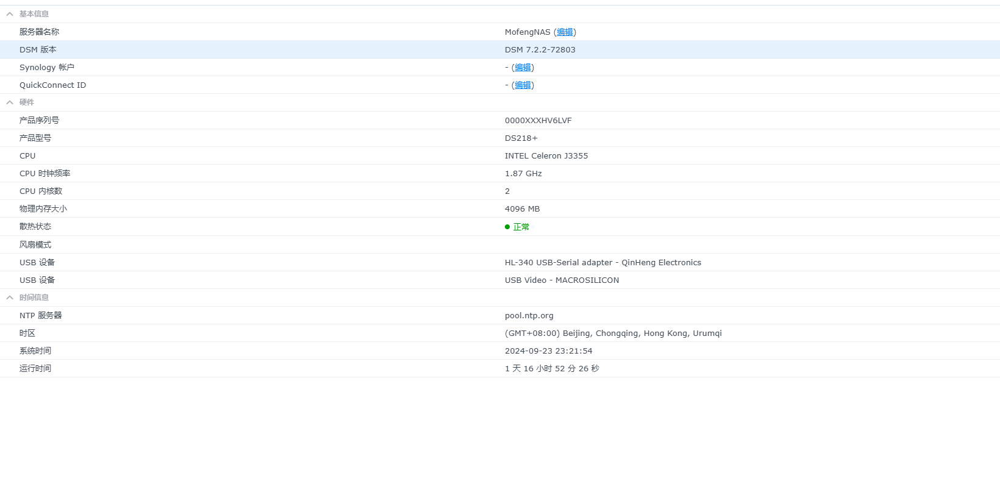
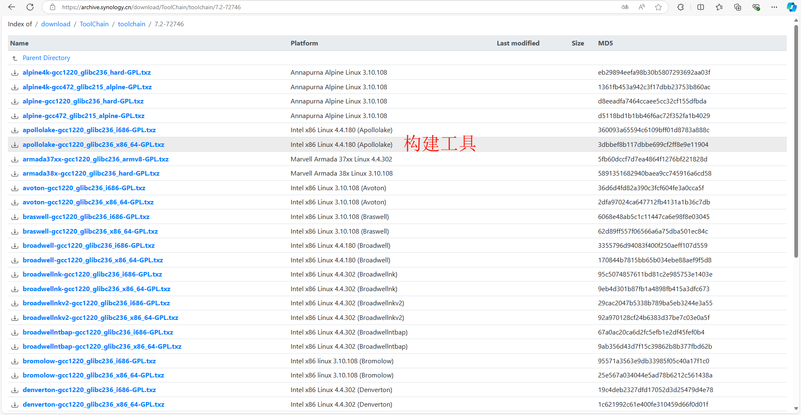
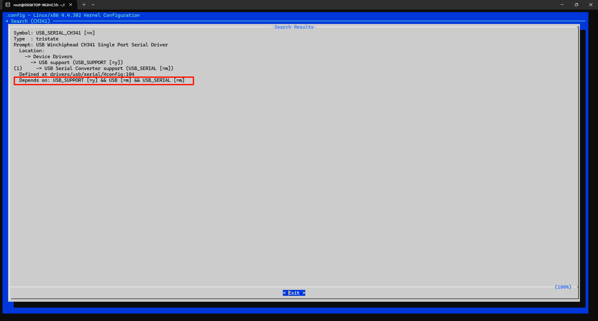
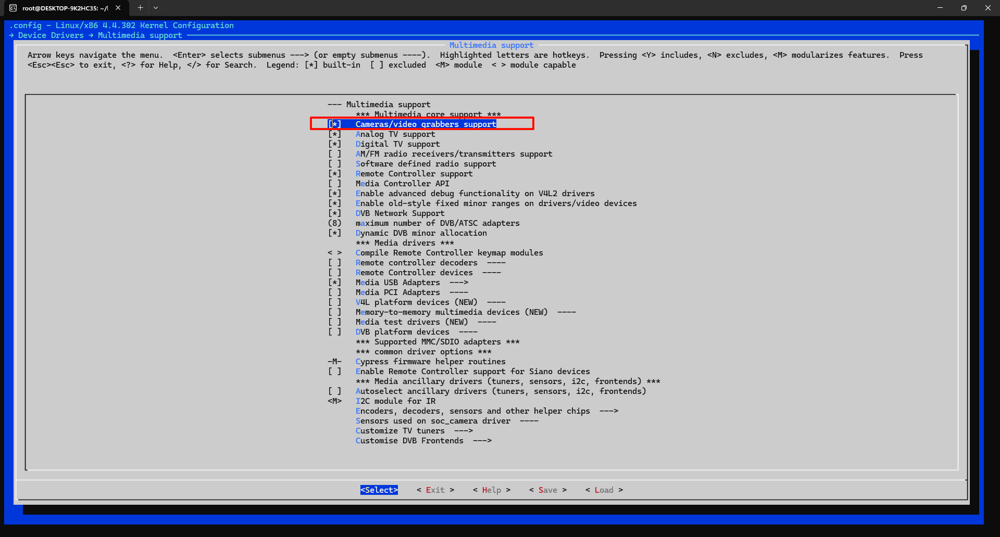
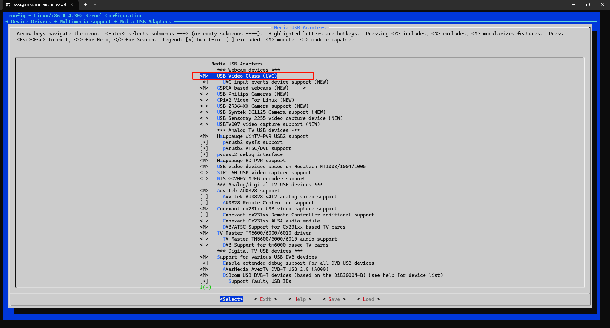
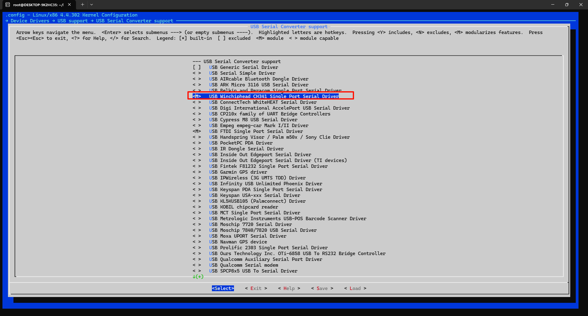
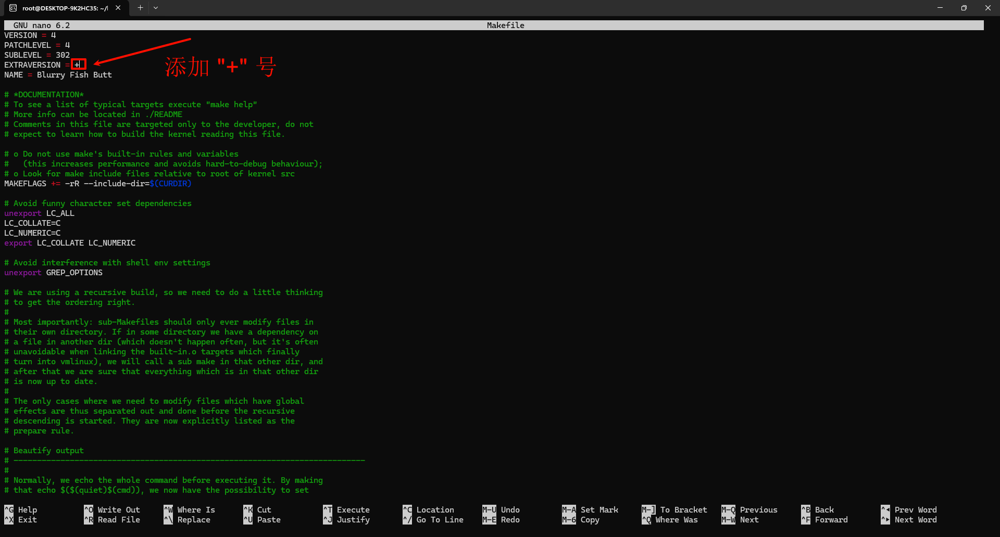

### 前言

群晖 NAS 系统也是使用的 Linux 系统，但对 NAS 用途进行了定制，可能缺少折腾其他应用所需的内核模块。这篇文章来写一下如何为群晖编译内核模块。

首先需要明确需要编译的模块。我想在 NAS 上使用 Docker 部署 One-KVM，需要映射 USB 采集卡和 USB 串口设备，对应 UVC 驱动和 CH340 驱动，然而群晖缺少内核驱动无法识别这两个 USB 设备，故需要自己编译。下图是最终效果，可以看到驱动架构加载成功，设备路径也出来了。


### 说明

群晖开源文件下载站：[Synology Archive Download Site - Index of /download](https://archive.synology.cn/download)

在这里可以下载到群晖的大部分源代码（为群晖的开源点赞），编译内核只需要群晖的构建工具链和内核源代码就足够了。根据自己群晖的型号和版本下载对应文件。

开启群晖 SSH 并连接执行 `uname -a` 可以得到内核信息：`Linux MofengNAS 4.4.302+ #72803 SMP Mon Aug 19 19:59:09 CST 2024 x86_64 GNU/Linux synology_apollolake_218+`，在群晖控制面版 信息中心可以看到群晖 DSM 版本信息：`DSM 7.2.2-72803`。这个信息很重要，后面要用到。



然后根据群晖型号和 DSM 版本下载 Linux 内核源代码和构建工具，内核源代码在  `ToolChain/Synology NAS GPL Source/DSM 版本号` 目录下，构建工具在 `ToolChain/toolchain/DSM 版本号` 目录下。下图和命令是作者群晖 NAS 对应的文件，大家需要根据自己的情况做相应修改。




```bash
#下载文件
wget https://global.synologydownload.com/download/ToolChain/Synology%20NAS%20GPL%20Source/7.2-64570/apollolake/linux-4.4.x.txz
wget https://global.synologydownload.com/download/ToolChain/toolchain/7.2-72746/Intel%20x86%20Linux%204.4.180%20%28Apollolake%29/apollolake-gcc1220_glibc236_x86_64-GPL.txz

#解压文件
tar xJvf apollolake-gcc1220_glibc236_x86_64-GPL.txz
tar xJvf linux-4.4.x.txz
```

### 编译

**开启模块选项**

推荐在 Ubuntu 系统下进行内核模块的编译，直接在群晖上编译内核由于依赖的原因非常麻烦，我这里是在 WSL2 子系统下进行的编译。

进入 Linux 内核源码目录 `linux-4.4.x`，从 `synoconfigs`  目录中复制对应型号的编译配置文件（这步不能省略），根据自己的需求然后开启编译选项，在菜单中可以按下 "/" 可以搜索选项查看依赖关系 。

```bash
cd linux-4.4.x/
ls synoconfigs
cp synoconfigs/apollolake .config
make menuconfig
```




将图中所需依赖项都开启，然后保存退出。







**正式编译**

**注意**：你以为现在就可以开始编译模块了，实际上还不行。这里有一个坑，驱动的 `vermagic` 要与内核一致才能正确加载，而默认编译的驱动 `vermagic` 少了一个 "+" 号，直接加载会报错，如下图。这里提一嘴，后面你编译好了驱动可以使用 `sudo insmod 文件名.ko` 和 `sudo dmesg` 来验证是否可以使用。


这里需要修改 `Makefile` 文件最开始的地方，修改为群晖对应内核版本，使驱动 `vermagic`  正确。



现在可以开始编译了，这里需要使用群晖的 `gcc` 工具链，不能使用系统自带的 `gcc`。如果有缺少什么依赖的话直接安装就好了。

```bash
#准备编译，直接编译会报错
make clean
make -j4 CROSS_COMPILE=../x86_64-pc-linux-gnu/bin/x86_64-pc-linux-gnu- prepare
make -j4 CROSS_COMPILE=../x86_64-pc-linux-gnu/bin/x86_64-pc-linux-gnu- scripts

#正式编译 ko 文件
make -j4 CROSS_COMPILE=../x86_64-pc-linux-gnu/bin/x86_64-pc-linux-gnu- -C . M=drivers/media/v4l2-core modules
make -j4 CROSS_COMPILE=../x86_64-pc-linux-gnu/bin/x86_64-pc-linux-gnu- -C . M=drivers/media/usb/uvc modules
make -j4 CROSS_COMPILE=../x86_64-pc-linux-gnu/bin/x86_64-pc-linux-gnu- -C . M=drivers/usb/serial modules
```

编译后可以在对应源码目录得到以下文件。验证通过后将这些文件都放入群晖 NAS 的 `/lib/modules` 目录下，执行 `sudo depmod -a` 命令刷新，手动加载对应驱动或者重启一下 NAS，就可以看到效果，连接的 USB 外设都识别了。

```bash
videodev.ko
videobuf2-core.ko
v4l2-common.ko
videobuf2-v4l2.ko
videobuf2-memops.ko
videobuf2-vmalloc.ko
uvcvideo.ko
ch341.ko
```


### 参考

[搭建群晖 Synology NAS 开发环境，自编译网卡等驱动 - VirCloud's Blog - Learning&Sharing](https://vircloud.net/exp/dsm-driver.html)