### 开始

虚拟机 One-KVM 整合包为预装了 One-KVM 的虚拟机磁盘文件，使用虚拟机磁盘文件新建虚拟机后直通 USB 设备后即可使用 One-KVM。下面以 Vmare 为例说明 One-KVM 虚拟机整合包的详细使用方法，VirtualBox 的操作方法大同小异。

所需软件：Vmare 或 VirtualBox

所需外设：USB HDMI 采集卡、CH340+CH9329 USB 一体线

虚拟机最低配置：1核心、512M 内存

### Vmare

#### 新建虚拟机

先解压好磁盘文件备用，打开 VMware Workstation Pro 软件主界面，选择 文件(F) --> 新建虚拟机(N)，在弹出来的新建虚拟机向导中选择 自定义(高级)(C) 并点击下一步。兼容性保持默认就好，没有特殊需求无需调整，再次选择点击下一步。

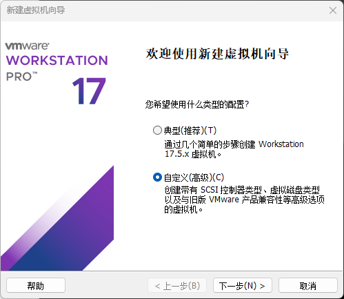

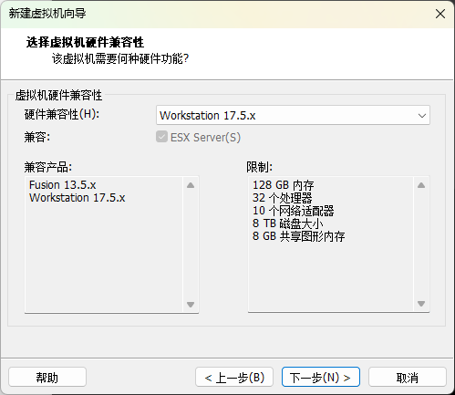

选择 稍后安装系统，点击下一步，客户机操作系统选择 Linux(L)，再次点击下一步，填入一个合适的名称选择虚拟机存文件存放位置，再次点击下一步。

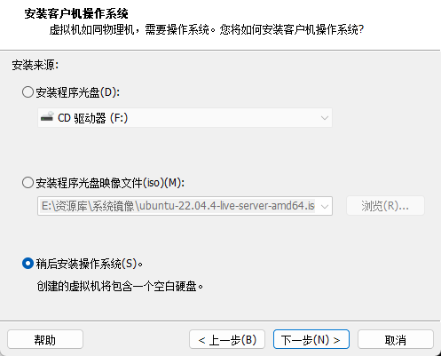

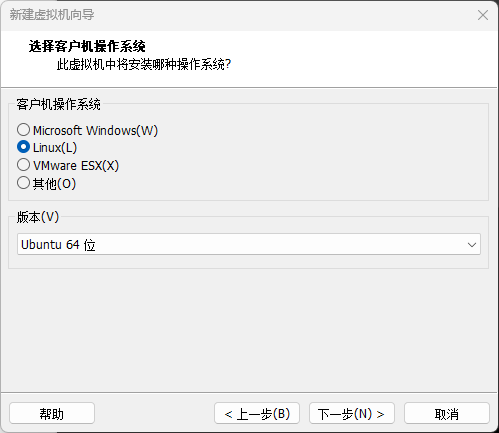

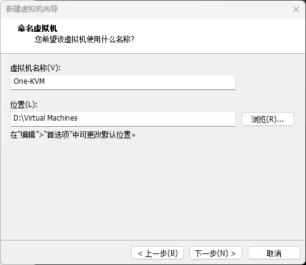

处理器配置和虚拟机内存量按需选择，最低1核心、512 M内存。虚拟机网络连接同样按需选择，推荐桥接模式（与宿主机处于同一局域网，减少额外端口转发）。I/O 控制器和虚拟磁盘类型类型保持默认就好。

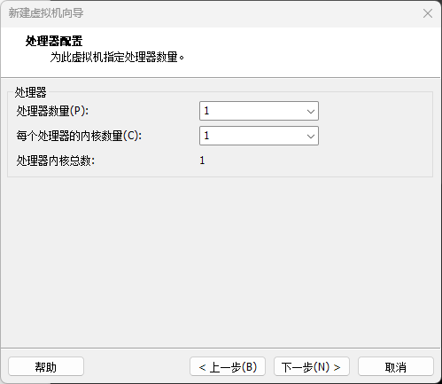

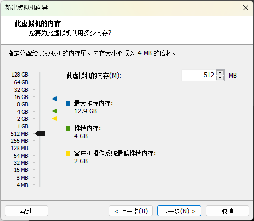

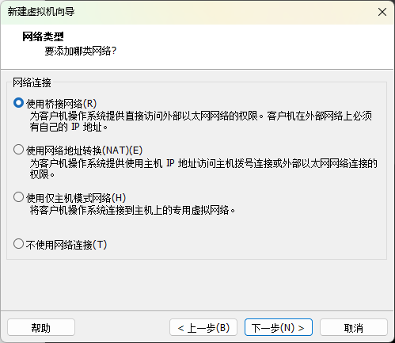

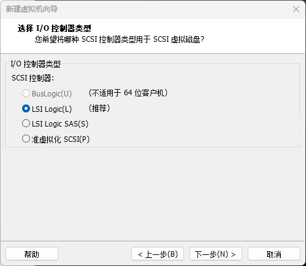

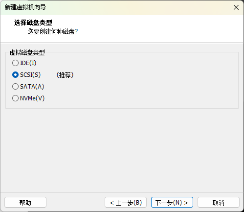

选择磁盘时选择 使用现有虚拟磁盘(E)，在下一步选中解压好的磁盘文件，磁盘格式保持现有格式。在下一步中选择完成（这时不要着急启动，还有修改虚拟机其它设置）。

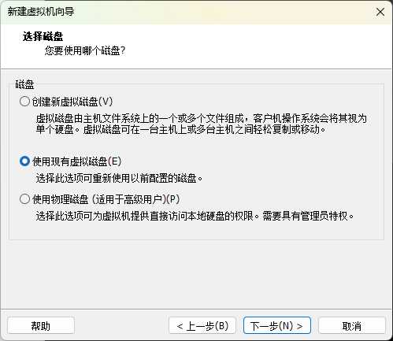

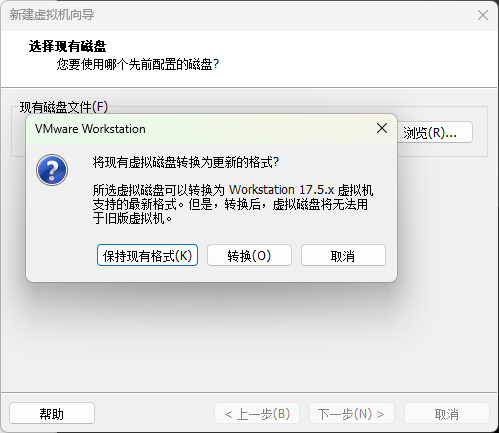

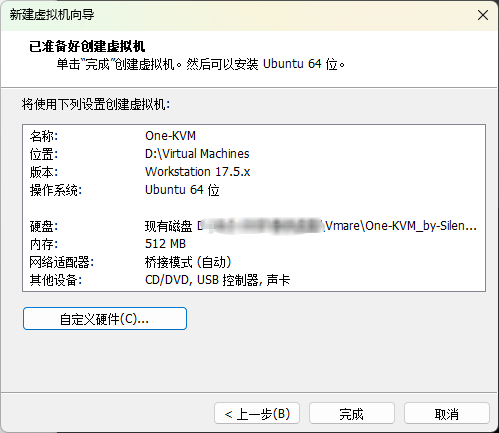

#### 修改虚拟机设置

虚拟机主页选择 编辑虚拟机设置，将 USB 控制器 的 USB兼容性(C) 属性值修改为 USB 3.1。进入属性界面，选择高级，将固件类型修改为 UEFI(E)，最后单击确定。为启用了  Hyper-V 的主机禁用侧通道缓解(S) 选项打勾可以减少虚拟性能损失，根据实际情况按需勾选即可 。

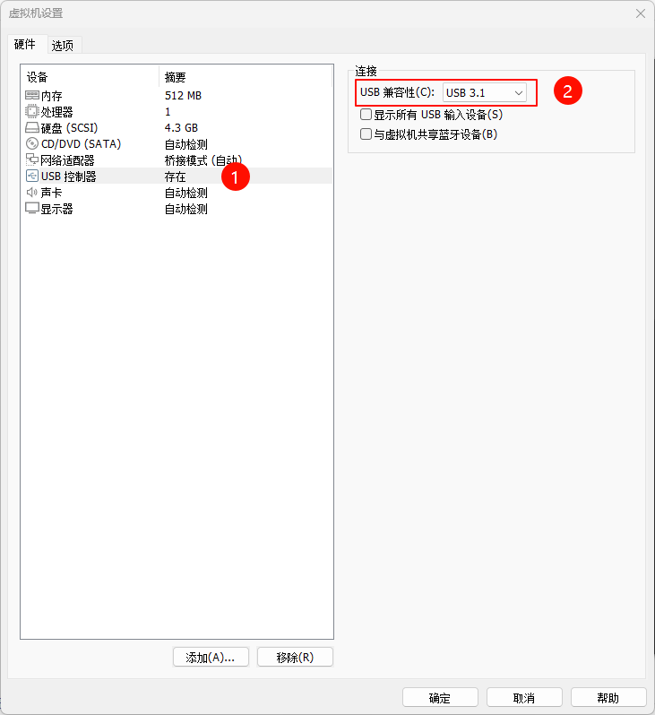

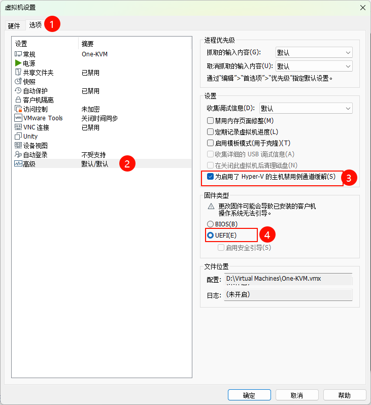

#### 启动虚拟机

完成上述设置就可以启动虚拟机了。将 USB HDMI 采集卡、CH340+CH9329 USB 一体线 连接至宿主机，启动虚拟机后将这两个 USB 设备直通给虚拟机就可以开始使用 One-KVM 了。

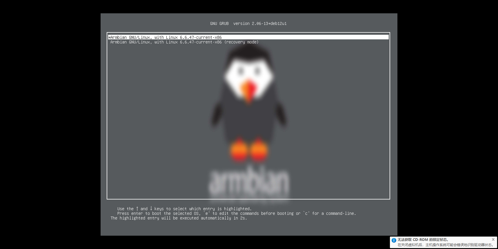

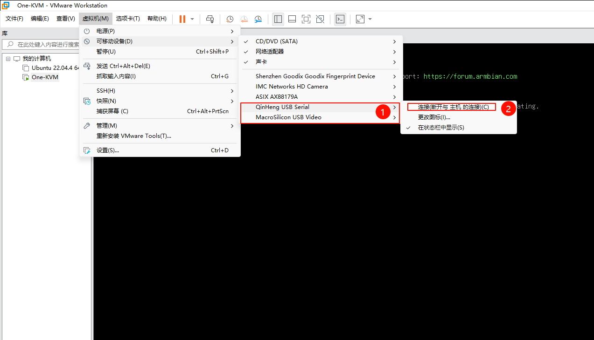

#### 使用

在浏览器访问虚拟机 IP 即可进入 WEB 界面。首次访问需要信任自签证书，点击浏览器高级选择继续访问。One-KVM WEB 默认账号密码为 admin/admin。

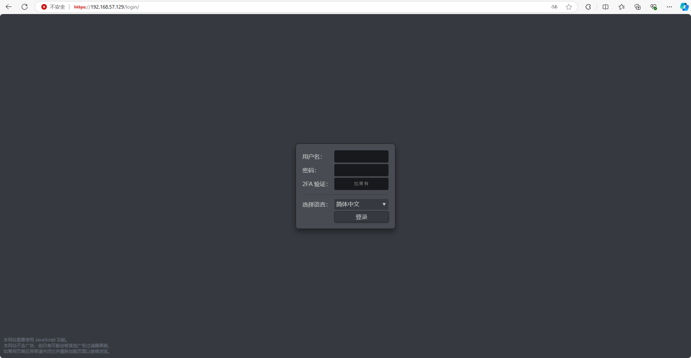

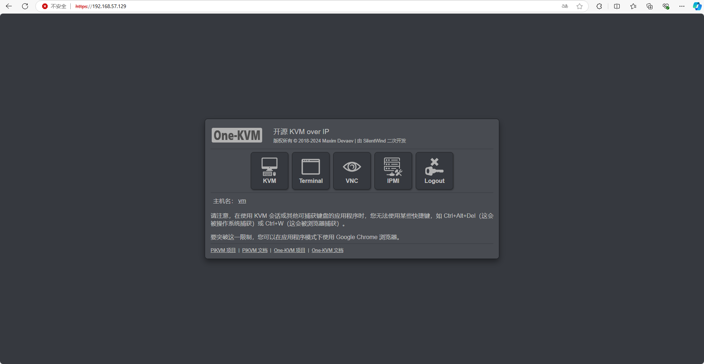

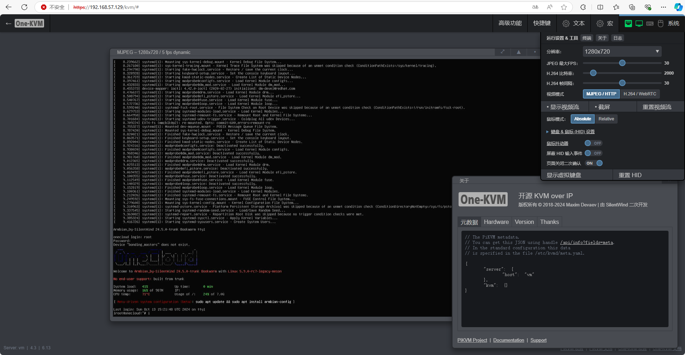

#### 其他

如果 Vmare 虚拟机网络使用桥接模式没有 IP 分配，可能是虚拟机自动桥接绑定了错误的网卡，可以在虚拟机网络编辑器修改要桥接的网卡。

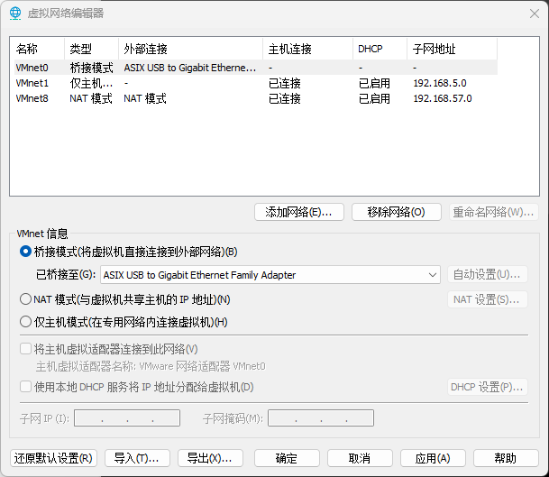

