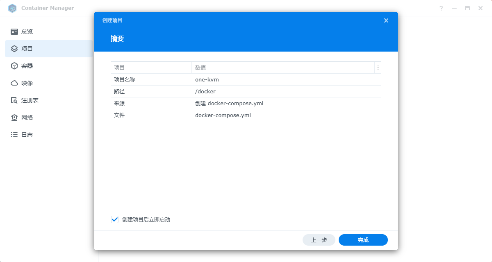

### 准备

在群晖控制面板 -- 终端机和 SNMP -- 终端机勾选 启动 SSH 功能，使用 SSH 客户端连接群晖 SSH。


按照 [《为群晖 NAS 编译额外内核驱动》](synology_ko.md) 文章内容为群晖补全相关驱动，**如果此步未完成后续无法部署**。

可使用 `ls /dev | grep -E "video|ttyUSB"`，如果有设地址，就说明准备好了，如下图。准备好了就用不着 SSH 了，可以在控制面板同样的地方关闭 SSH。


### 部署

进入群晖容器管理界面，打开左边侧栏选择新建项目。设置好项目名名称和路径后选择创建 docker-compose.yml ，填入如下内容然后点击下一步，网页门户设置可以不修改继续下一步，最后点击完成，等待容器创建启动。

容器启动完成就可以开始使用了，访问 https://NASIP:4430 就可以开始使用了，默认账号密码  `admin `/ `admin`，更多 Docker 环境变量的设置可以查阅 [Docker 部署](docker_install.md)。

```yaml
version: '3.7'
services:
    kvmd:
        image: registry.cn-hangzhou.aliyuncs.com/silentwind/kvmd
        ports:
        - "8080:8080"
        - "4430:4430"
        - "5900:5900"
        - "623:623"
        devices:
        - "/dev/video0:/dev/video0"
        - "/dev/ttyUSB0:/dev/ttyUSB0"
```





**最终效果**

