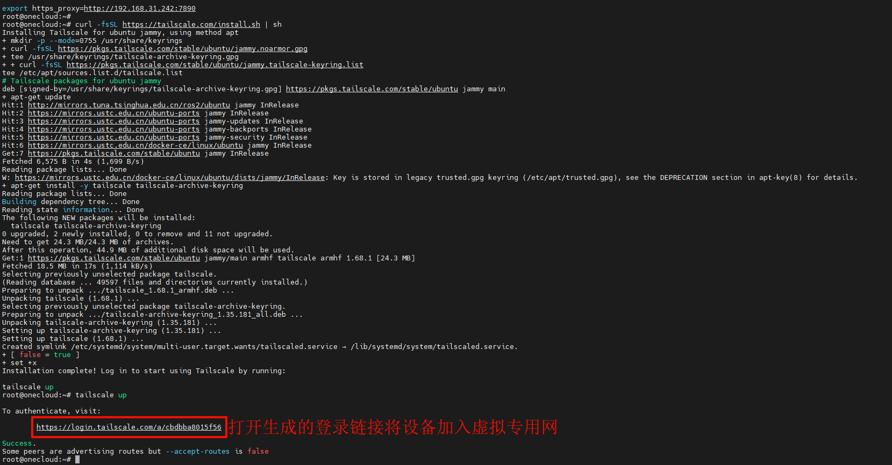
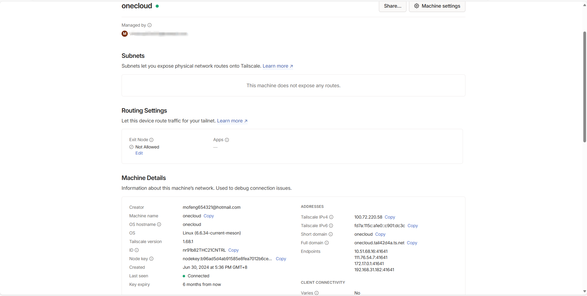

> Tailscale 是一种虚拟专用网服务，可让您在世界任何地方都能安全、轻松地访问您拥有的设备和应用程序。它使用开源的 WireGuard 协议实现加密的点对点连接，这意味着只有在你的专用网络上的设备才能相互通信。

### Tailscale 客户端安装

```bash
#Tailscale 客户端一键安装脚本
curl -fsSL https://tailscale.com/install.sh | sh
#启动 Tailscale
tailscale up
```





可以看到 Tailscale 网页管理后台已经出现新设备了，多端互访、异地组网等更详细的内容可以参考 Tailscale 官方文档 [Docs · Tailscale Docs](https://tailscale.com/kb)。