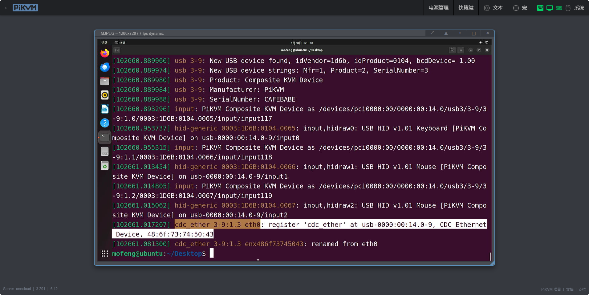
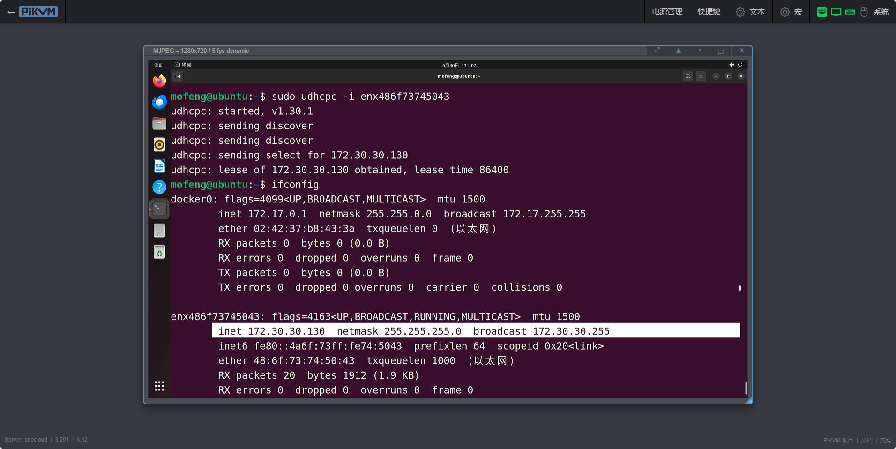
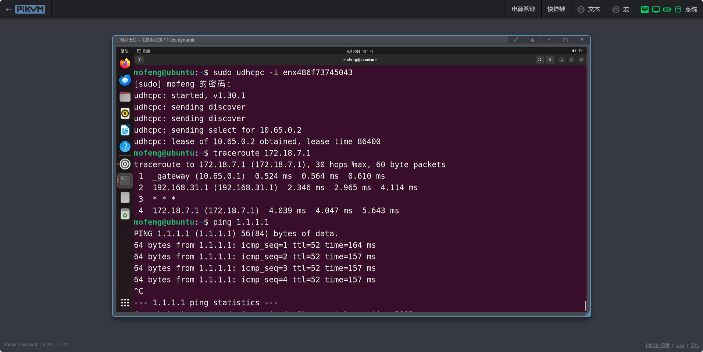

### 基本配置

1. 编辑 `/etc/kvmd/override.yaml` 文件添加以下行：
    ```yaml
    otg:
        devices:
            ethernet:
                enabled: true
                driver: ecm
                host_mac: 48:6f:73:74:50:43
                kvm_mac: 42:61:64:55:53:42
    ```
    `host_mac` 地址将用于被控机的网络接口。`kvm_mac` 表示将分配给 PiKVM 本地接口的地址，PiKVM 接口应该是 `usb0` 接口。如果没有指定 `host_mac` 或 `kvm_mac`，将使用随机值。驱动程序参数表示 USB 网络将使用的协议，默认值为 ecm，其他可用值包括 eem、ncm、rndis 和 rndis5。

    **驱动程序兼容性：**

    | 驱动程序 | 操作系统                               |
    | :------- | :------------------------------------- |
    | ecm      | Linux macOS                            |
    | eem      | Linux                                  |
    | rndis5   | 从Windows XP到Windows 7 Linux > 2.6.13 |
    | rndis    | Windows 7及以上 Linux > 2.6.13         |
    | ncm      | Windows 10及以上 Linux > 2.6.37 macOS  |

    

2. 要在被控机上自动配置 USB 网络，建议使用 `kvmd-otgnet` 服务。它会自动配置防火墙，启动 DHCP 为本地 PiKVM `usb0` 接口和被控机接口分配 IPv4 地址。默认情况下，将为 `usb0` 接口和被控机接口分配 172.30.30.0/24 地址。出于安全考虑，从被控机到 PiKVM 端的所有传入连接都将被阻止（ICMP 和用于 DHCP 的 UDP 端口 67 除外）。
    ```bash
    sudo systemctl start kvmd-otgnet
    sudo systemctl enable kvmd-otgnet
    ```
    在 `kvmd-otgnet`  服务运行后，被控机可能需要手动进行 DHCP 请求才能获取到 IP 地址。
    ``` 
    #在 Ubuntu 22.04 上经过测试
    
    #根据 host_mac 地址判断 USB 网络接口名称
    ifconfig -a
    sudo apt install udhcpc
    udhcpc -i 网络接口
    ```
    
    如果要允许从被控机访问 PiKVM 界面，则、需要使用 `/etc/kvmd/override.yaml` 文件在白名单中添加端口 80 和 443，如下所示：
    ```yaml
    otgnet:
        firewall:
            allow_tcp: [80, 443]
    ```

### 路由转发

默认情况下，只允许 PiKVM 和被控机主机之间互相通信，被控机主机无法访问 PiKVM 以外的其他主机。如果被控机主机需要通过 USB 以太网功能访问全部网络（即可以访问 PiKVM 可以访问的所有主机），需要在 `/etc/kvmd/override.yaml` 中添加下的配置。

1. 允许 IPv4 转发
    ```bash
    echo "net.ipv4.ip_forward = 1" > /etc/sysctl.d/99-kvmd-extra.conf
    ```
2. 在配置文件中添加用于转发请求的网络接口（默认网关）、添加 DNS 服务器以提供主机名解析服务，以及分配的虚拟网段。 
     `net` 参数定义 `usb0` 接口和被控机网络接口获取到的的网络地址范围，包括在 `post_start_cmd_append` 下定义的 DNS 服务器。注意：该网络不应与 PiKVM 所连接的网络网段相同。
    ```yaml
    otgnet:
        firewall:
            forward_iface: eth0
        commands:
            post_start_cmd_append:
            - "--dhcp-option=6,8.8.8.8"
        iface:
            net: 10.65.0.0/28
    ```
3. 重启 PiKVM。`reboot`
    

   

