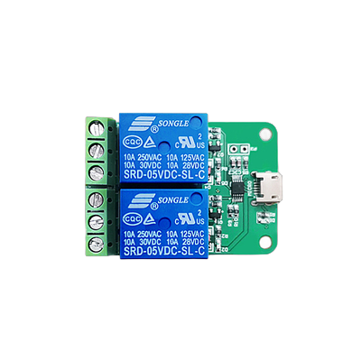

这里将介绍如何使用 USB 继电器实现 ATX 电源管理。

硬件：LCUS_HID USB 继电器<br>
路径：/dev/hidraw0




Docker 容器建立时映射继电器设备并设置环境变量  `-e ATX=USBRELAY_HID`

私家云二代示例命令：
```bash
docker run --name kvmd -itd --privileged=true \
    -v /dev:/dev -v /sys/kernel/config:/sys/kernel/config \
    -v /lib/modules:/lib/modules:ro -e OTG=1 -e VIDEONUM=1 -e ATX=USBRELAY_HID \
    -p 8080:8080 -p 4430:4430 -p 5900:5900 -p 623:623 \
    silentwind0/kvmd
```

