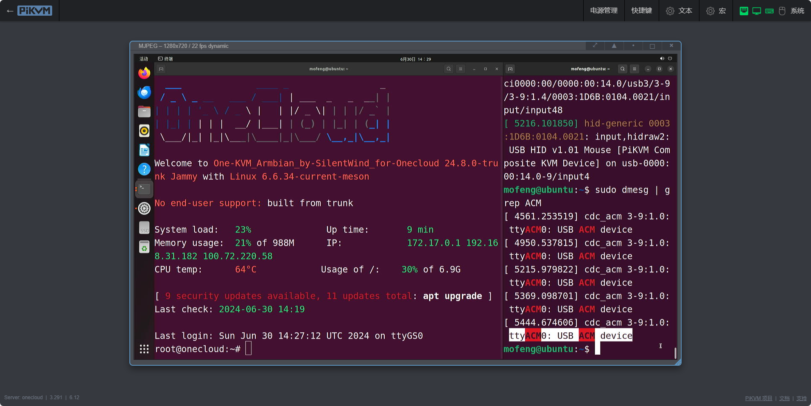

### 基本配置

此功能可用于从被控机到 PiKVM 的终端访问，或用于需要串行连接的其他目的。

1. 编辑 `/etc/kvmd/override.yaml` 添加如下串口配置。
   ```yaml
   otg:
       devices:
           serial:
               enabled: true
   ```

2. 运行以下命令：
   ```bash
   sudo echo ttyGS0 >> /etc/securetty
   ```

3. 创建目录 `/etc/systemd/system/getty@ttyGS0.service.d` ，然后在此目录中编辑文件 `override.conf` ，将其下面的内容复制到此文件。
   ```bash
   sudo mkdir -p /etc/systemd/system/getty@ttyGS0.service.d
   sudo nano /etc/systemd/system/getty@ttyGS0.service.d/override.conf
   ```
   ```
   [Service]
   TTYReset=no
   TTYVHangup=no
   TTYVTDisallocate=no
   ```

4. 运行以下命令：
   ```bash
   sudo systemctl enable getty@ttyGS0.service
   sudo reboot
   ```

5. 重新启动 PiKVM 后，就可以访问 USB 所连接的服务器上的虚拟串行端口，可以使用 screen、putty 或类似的程序从服务器访问 PiKVM ，该端口设备名可能为 `/dev/ttyAMA0` 或 `/dev/ttyACM0`。
   ```bash
   #串口连接示例
   sudo screen /dev/ttyACM0 115200
   ```
   

