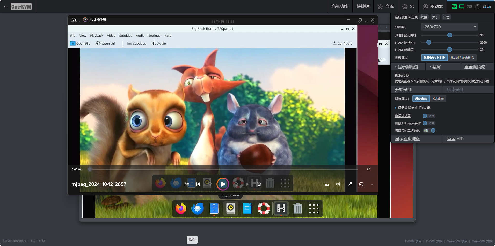

根据需求可以选择网页前端视频录制或后端命令行视频录制。

### 前端录制

网页视频音视频录制功能由浏览端实现，调用浏览器 MediaStream Recording API 进行视频的录制和保存。

此功能支持 MJPEG 视频模式（无音频）、H.264/WebRTC 视频模式（可包含音频）下的视频画面录制。

点击网页右上角 --> 系统 --> 开始录制即可开始当前视频画面的录制，点击结束录制后浏览器会自动下载录制的视频文件，文件格式为 webm。

**实际效果**



### 后端录制

**视频录制**

登录 One-KVM 主机终端，使用 ustreamer-dump 工具进行视频导出，再使用 ffmpeg 进行视频转码。

可以使用 `ustreamer-dump --help` 查看此工具用法，示例如下：

```bash
#录制原始码流
#录制 h264 视频码流（需 ustreamer 启用 h264）
ustreamer-dump -s kvmd::ustreamer::h264 -o video-recoed1.h264

#录制 mjpeg 视频码流（需 ustreamer 启用 mjpeg）
ustreamer-dump -s kvmd::ustreamer::jpeg -o video-recoed1.jpeg

#录制 yuyv 视频码流（需 ustreamer 启用 yuyv）
ustreamer-dump -s kvmd::ustreamer::yyuyv -o video-recoed1.yuyv
```

```bash
#录制的同时转码视频为 MP4 格式
# mjpeg --> mp4
ustreamer-dump -s kvmd::ustreamer::jpeg -o - | ffmpeg -use_wallclock_as_timestamps 1 -i pipe: -c:v libx264 video-recoed1.mp4

#h.264 --> mp4
ustreamer-dump -s kvmd::ustreamer::h264 -o - | ffmpeg -use_wallclock_as_timestamps 1 -i pipe: -c:v libx264 video-recoed2.mp4
```