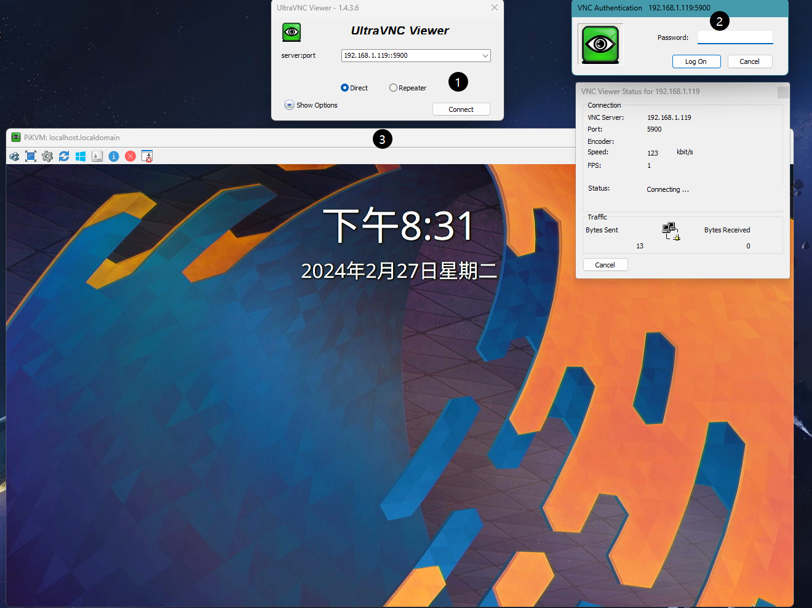
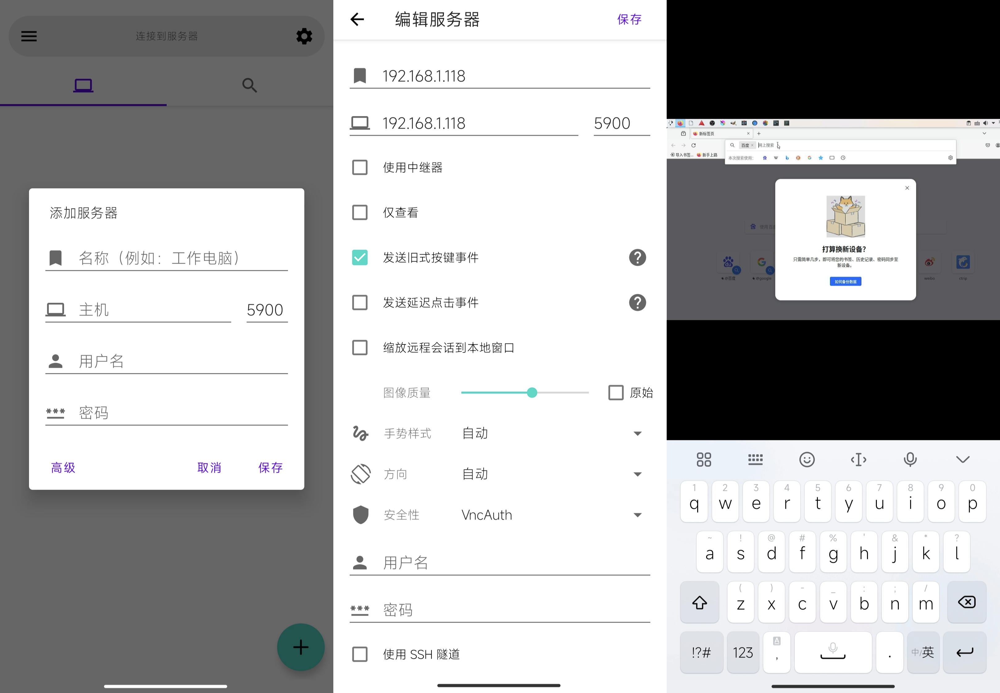
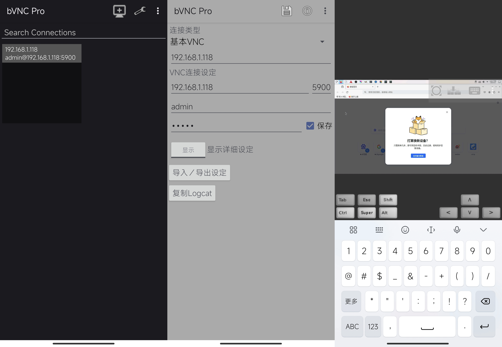
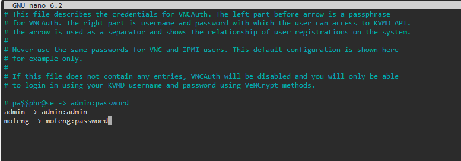

# VNC连接

除 Web UI 外，还可使用普通 VNC 客户端访问 PiKVM。与浏览器相比，VNC 的主要优势在于能将图像扩展到全屏，并能完全拦截所有键盘快捷键。在某些情况下，VNC 比浏览器反应更快，尤其是在客户端电脑性能较弱的情况下。PiKVM 上的 VNC 性能无法与普通 VNC 服务器或操作系统级别的类似远程访问工具进行比较。

!!! warning
    不要在不信任的网络上使用没有 X.509 或 TLS 加密的 VNC！否则，您的密码将以纯文本形式在网络上传输。不幸的是，VNC 协议的实现就是如此。

!!! note
    不支持的客户端： RealVNC - 不支持大多数广泛使用的开放式 VNC 协议扩展； Remmina - 与服务器匹配设置的算法略有缺陷，正在改进； Guacamole - 未正确实现 vencrypt，不支持 JPEG 压缩； Vinagre - 未正确实现 vencrypt，会崩溃。

### Windows

对于 Windows，可以使用 UVNC 和T igerVNC，可在网盘下载（位置：/玩客云/PiKVM相关软件/）。下面是 UVNC 的使用示例。

### 安卓 Android

对于安卓移动端，可以使用AVNC和bVNC Pro这两个开源软件。两个应用的操作手势都支持触摸屏和触摸板。对于AVNC应用，不能使用默认的安全性设置，需手动修改安全性为Vncauth才能正常连接PiKVM VNC。

### 苹果 IOS

对于苹果 iOS ，可以使用 [bVNC](https://apps.apple.com/us/app/bvnc-pro/id1506461202) 应用程序，这是一个付费软件。

### VNCAuth身份认证

对于使用VNCAuth身份认证的VNC客户端（即只需使用密码不需要输入账户的VNC客户端），如果修改了PiKVM程序密码后，此身份认证文件不会自动修改，需手动在文件`/etc/kvmd/vncpasswd`修改或添加密码映射。添加内容为“自定义VNC密码 -> WEB账户:WEB密码”，如下为示例：

