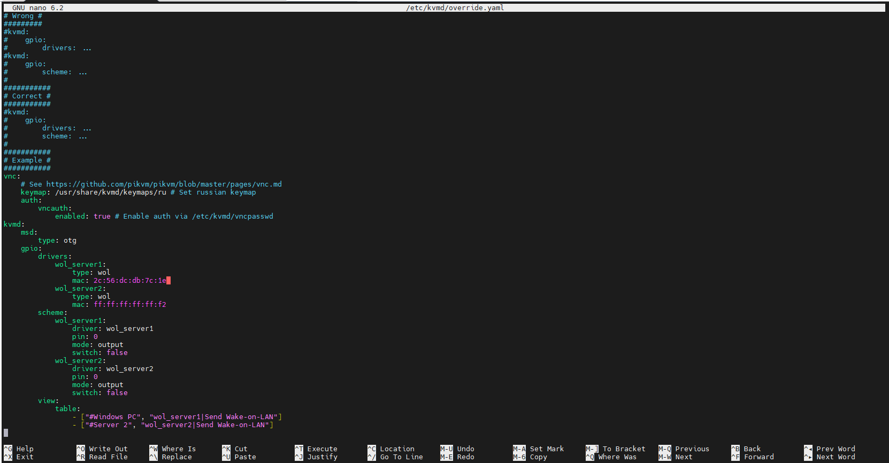

# 启用WOL网络唤醒

**WOL**（Wake On LAN），即网络唤醒，在被控机支持的情况下（部分机器可能默认关闭，需要手动开启），可以通过网络唤醒设备开机，实现机器开停自由。更详细的介绍和配置可查阅官方教程。

首先在获取被控机网卡的MAC地址记录下来（格式为linux小写），然后编辑 /etc/kvmd/override.yaml 添加如下内容，完成后重启服务 `systemctl restart kvmd` （请注意格式缩进，否则会导致服务启动失败）。

```yaml
    gpio:
        drivers:
            wol_server1:
                type: wol
                mac: 2c:56:dc:db:7c:1e
        scheme:
            wol_server1:
                driver: wol_server1
                pin: 0
                mode: output
                switch: false
        view:
            table:
                - ["#设备名称", "wol_server1|网络唤醒"]
```

