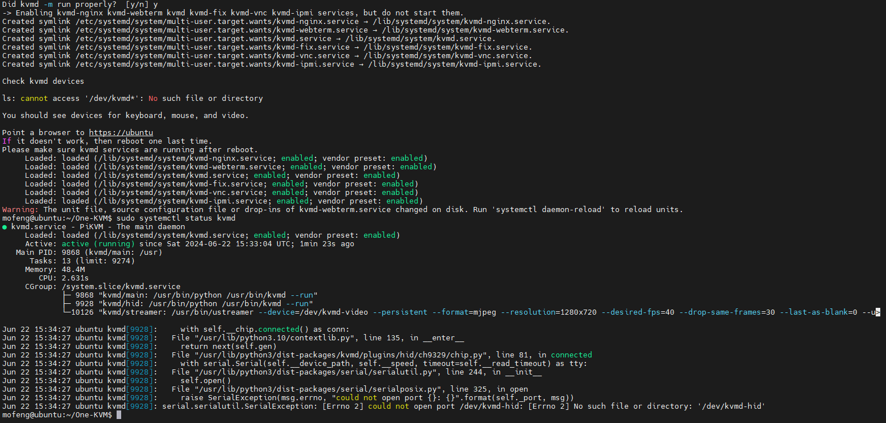

最初仅在 Arch 系 Linux 系统上做安装教程，因为这非常简单，只需要处理几个依赖项即可。后续发现  Arch 系 Linux 系统不适合做服务器系统，便基于 srepac/kvmd-armbian 项目的安装脚本对本项目进行了重构，使之能够在 Armbian Jammy 和 Ubuntu Jmamy 系统上进行 PiKVM 的安装。

### 硬件清单

所需硬件：X86主机、USB采集卡、USB HID（CH340+CH9329）

宿主机系统：Ubuntu Jammy


### 安装

一键脚本，适用于Ubuntu Jammy系统。演示站即使用此脚本安装。

```Bash
git clone --depth=1 https://github.com/mofeng-git/One-KVM.git
cd One-KVM
sudo bash install-x86.sh
#第一阶段安装完成需要重启，再进行第二阶段安装
sudo bash install-x86.sh

#可选功能：H.264 视频编码
sudo bash kvmd_h264_install.sh
```



### 实机演示

!!! note
    运行在云服务器上，实际效果因软硬件配置而异。

演示网站：[PiKVM X64 DEMO](https://1.12.77.48/)<br>
账号/密码：admin/admin

