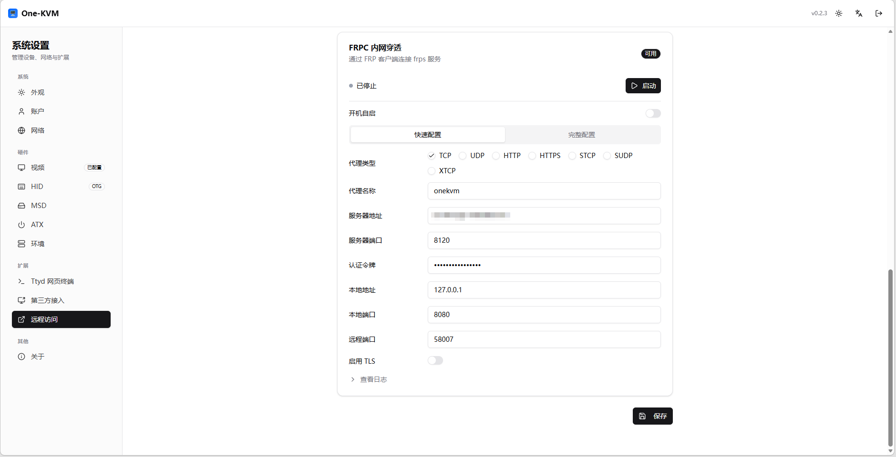
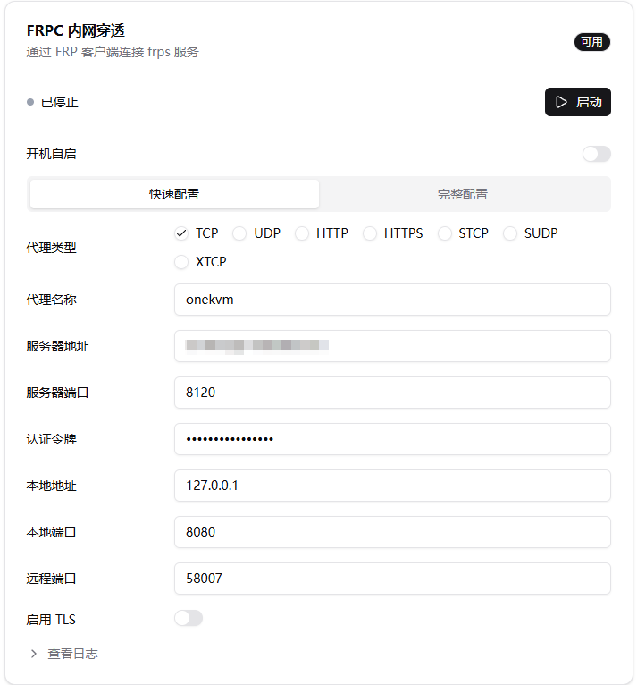
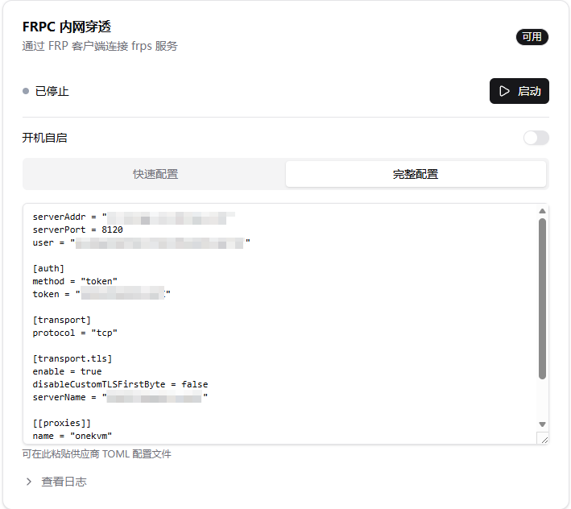
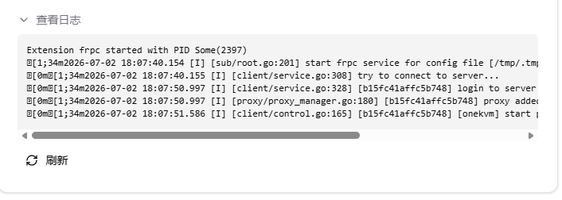

# FRP 内网穿透

FRP 可将 One-KVM 的本地服务映射到公网，用于在外网访问 KVM 控制台。One-KVM 内置 FRPC 扩展，可通过网页填写参数或粘贴完整 TOML 配置连接到 FRPS 服务。

需要系统内已安装 `frpc`（扩展页面显示“可用”），并提前准备好 FRPS 服务端地址、端口、认证令牌和远程端口。可以使用自建 FRPS，也可以使用第三方 FRP 服务商提供的配置。



## 配置项

| 项目 | 说明 | 示例/默认 |
| --- | --- | --- |
| 开机自启 | 系统启动后自动运行 FRPC | 关 |
| 代理类型 | FRP 代理协议，网页访问通常使用 TCP | `TCP` |
| 代理名称 | 当前代理配置名称 | `onekvm` |
| 服务器地址 | FRPS 服务端域名或 IP，不需要填写 `http://` 或 `https://` | `frp.example.com` |
| 服务器端口 | FRPS 监听端口 | `7000` |
| 认证令牌 | FRPS 配置中的 token | - |
| 本地地址 | One-KVM 本机服务地址 | `127.0.0.1` |
| 本地端口 | One-KVM 网页端口，通常为 8080 | `8080` |
| 远程端口 | FRPS 对外开放的访问端口 | `58007` |
| 启用 TLS | FRPS 支持 TLS 时可开启 | 关 |

## 快速配置

快速配置适合常见 TCP 端口映射。打开 **设置 → 扩展 → 远程访问 → FRPC 内网穿透**，选择 **快速配置**，填写服务端和端口信息。

如果要映射 One-KVM Web 页面，通常保持：

- 本地地址：`127.0.0.1`
- 本地端口：`8080`
- 代理类型：`TCP`

填写完成后点击 **保存**，再点击 **启动**。



## 完整配置

如果需要更复杂的 FRP 能力，或使用第三方服务商导出的配置，可以切换到 **完整配置**，直接粘贴 `frpc.toml` 内容。

完整配置会使用文本框中的 TOML 配置作为 FRPC 启动参数，适合配置多个代理、TLS、自定义传输方式、第三方平台模板等场景。



## 查看日志

启动后可以展开 **查看日志** 确认连接状态。正常情况下，日志中会出现登录服务端、添加代理、代理启动等信息。




## 远程访问

启动成功后，在外网访问：

```text
http://服务器地址:远程端口
```

如果 One-KVM 已配置 HTTPS，或服务商提供的是 HTTPS 入口，请按实际入口使用 `https://` 访问。

!!! warning "安全建议"
    FRP 会把 One-KVM 服务暴露到公网。建议设置强密码，并避免把远程端口设置为容易被扫描的常见端口。
