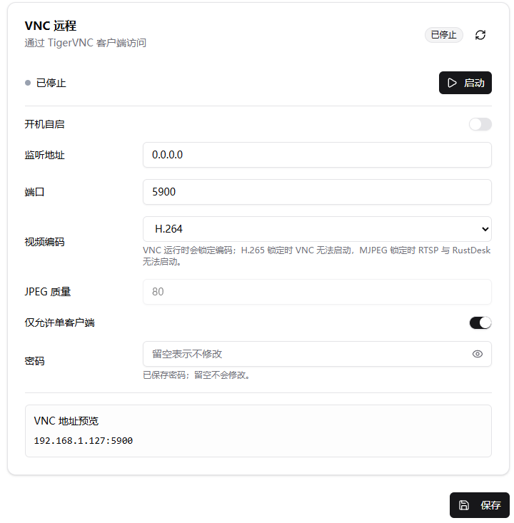
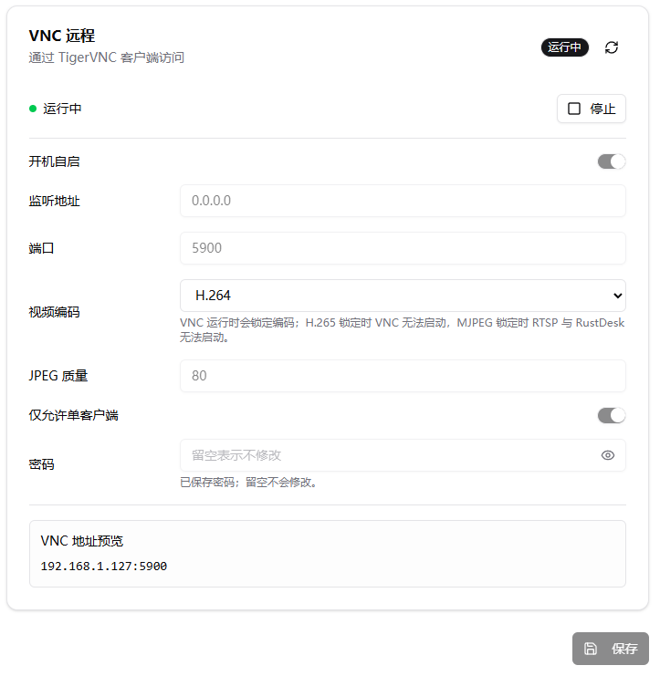
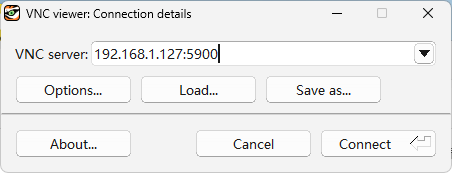
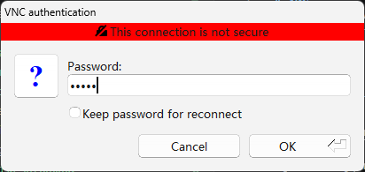
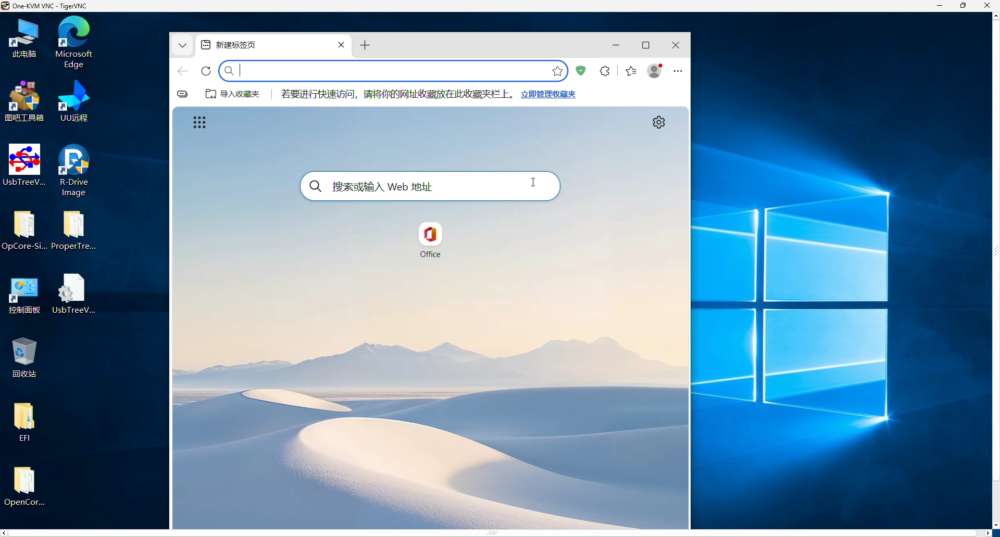

# VNC 远程

One-KVM Rust 内置 VNC 远程访问，可通过 TigerVNC 客户端查看和控制当前 KVM 画面。当前 VNC 实现并非完整标准 VNC 服务器，目前请使用 [TigerVNC](https://sourceforge.net/projects/tigervnc/) 连接；RealVNC Viewer、TightVNC Viewer 等客户端可能无法正常连接或显示。

VNC 会占用第三方视频输出编码。运行时会锁定当前编码；H.265 锁定时 VNC 无法启动，MJPEG 锁定时 RTSP 与 RustDesk 无法启动。

## 配置项

| 项目 | 说明 | 示例/默认 |
| --- | --- | --- |
| 开机自启 | 系统启动后自动启动 VNC 服务 | 关 |
| 监听地址 | VNC 服务绑定的本机地址。`0.0.0.0` 表示监听所有 IPv4 地址 | `0.0.0.0` |
| 端口 | VNC 服务端口 | `5900` |
| 视频编码 | VNC 输出编码，支持 Tight JPEG 和 H.264 | `Tight JPEG` |
| JPEG 质量 | 使用 Tight JPEG 时的视频质量 | `80` |
| 仅允许单客户端 | 限制同一时间只允许一个 VNC 客户端连接 | 开 |
| 密码 | VNC 连接密码，最多 8 个字符 | - |



## 配置步骤

1. 打开 **设置 → 扩展 → 第三方接入 → VNC 远程**
2. 设置监听地址、端口和视频编码
3. 首次启用 VNC 时必须设置密码，密码最多 8 个字符
4. 点击 **保存**，再点击 **启动**
5. 在 **VNC 地址预览** 中确认客户端连接地址

启动后，页面状态会显示为“运行中”，运行期间配置项会被锁定。如需修改端口、编码、JPEG 质量或密码，请先停止 VNC 服务，保存配置后再启动。



## 使用 TigerVNC 连接

在 TigerVNC Viewer 中填写 One-KVM 的 VNC 地址：

```text
设备IP:5900
```



输入在 One-KVM 设置页中配置的 VNC 密码后连接。



连接成功后即可在 TigerVNC 窗口中查看并控制被控机画面。

