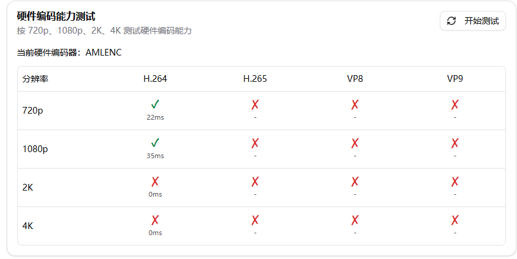
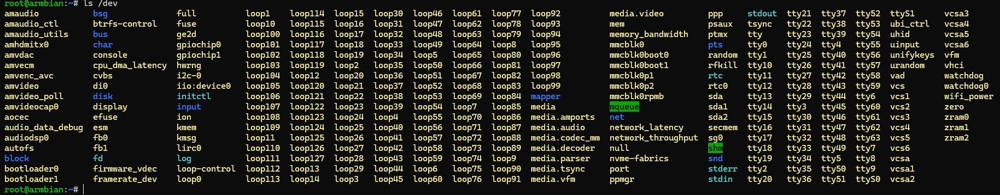
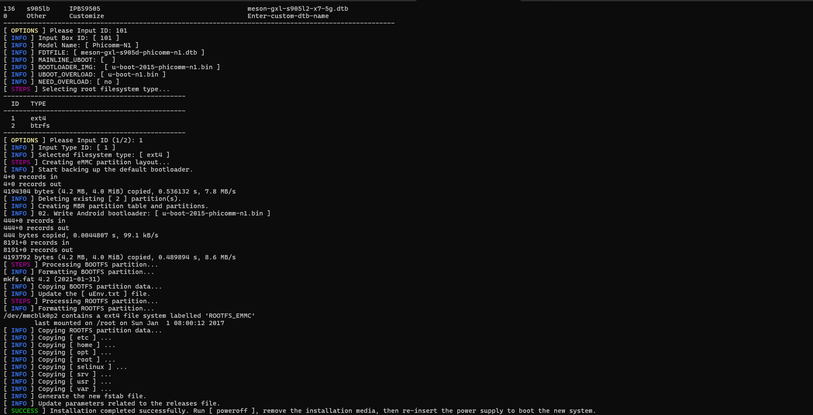
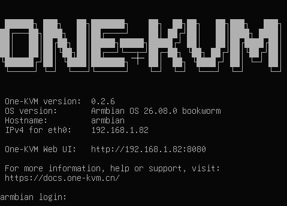

斐讯 N1 采用了 S905 四核 CPU，搭配 2GB 内存和 8GB 内部储存空间。它配备了一个千兆网络接口、2个 USB 2.0接口，并提供双频 WIFI 、蓝牙和 HDMI 输出。

已有 Docker 和 DEB 软件包两种部署方式，两者操作较为简单。若选择整合包部署方式，需要[赞助](../other/thanks.md)作者并联系作者获取镜像。

## 整合包介绍

斐讯 N1 最新整合包名称如下：

- One-KVM-RUST_by-SilentWind_N1_v0.2.6_260815-da20d8b.img.xz
- One-KVM-RUST_by-SilentWind_N1-Hwcodec_v0.2.6_260815-da20d8b.img.xz

优势：

- 两者都应用了 PiKVM MSD 内核补丁，支持大于 2.2G 的 ISO 挂载和虚拟媒体设备名称自定义；
- 前者基于 ophub 系统，Linux 内核版本为 6.12.x；后者基于 coreelec 系统移植，Linux 内核版本为 4.9.x，支持晶晨硬件编解码。

后者整合包支持硬件编解码，可使用晶晨硬件编码器进行 AMLENC H.264 视频编码。两者安装方式无差异，可根据需要自行选择。

## 整合包部署

1. **准备 U盘启动介质**：将 One-KVM 整合包写入U盘，再将U盘插入 N1 盒子远离 HDMI 的那个USB接口。
2. **从 U盘引导**：接通电源即可自动启动U盘。若无法从 USB 设备启动，可能需要先降级原厂系统。
3. **将系统安装至 eMMC**：U盘的系统成功启动后，通过 HDMI 或 SSH 登录终端，执行 `armbian-install`，选择与主板版本对应的型号`101`。

下图为 `armbian-install` 安装过程：

若后续需要再次刷机，可以将新镜像写入U盘，插入后上电会优先启动U盘上的系统。

## 使用说明

系统首次启动后，约有 4.8 GB 可用存储空间。

**硬件连接**

1. 将 USB HDMI 采集卡插入远离 HDMI 接口的普通 USB 接口，再使用 HDMI 线连接采集卡和被控机的 HDMI 输出接口。
2. 将 USB 双公线插入接近 HDMI 接口的 USB OTG 接口，另一端插入被控机的 USB 接口。
3. 确保所有连接稳固，再接入网线和电源。

!!! warning "硬件安全警告"

    为避免潜在风险（如被控设备无法正常启动或识别设备，甚至极少数情况下造成硬件损坏），强烈建议在使用 USB 双公线前采取以下任一安全措施：

    方案一：剪断或移除 USB 线中的红色 5V 电源线（VCC），仅保留数据线（D+/D−）和地线（GND），以切断供电路径；

    方案二：在 USB 链路中串接一个带独立电源开关的 USB HUB，并确保在连接时关闭其电源开关。

    部分低功耗设备可能在未通主电源的情况下，通过 USB OTG 接口从 KVM 设备反向取电，导致进入异常状态——即使后续接通主电源也可能无法正常启动。

    **除非您明确了解操作后果，否则请务必采用上述防护措施以保障设备安全。**

**HDMI 终端**

通过 HDMI 输出终端可以查看设备 IP 地址和软件版本。

**SSH 远程登录**

Armbian 系统默认开启 SSH 服务，初始用户名和密码为 `root` / `1234`。请尽快修改默认密码。

!!! warning "系统升级警告"
    不建议使用 `apt upgrade` 升级内核和设备树，可能会出现系统异常，OTG 功能无法使用。

**WIFI**

可以在终端使用 `nmtui` 命令进入命令行界面，选择激活连接进入 WIFI 连接界面。