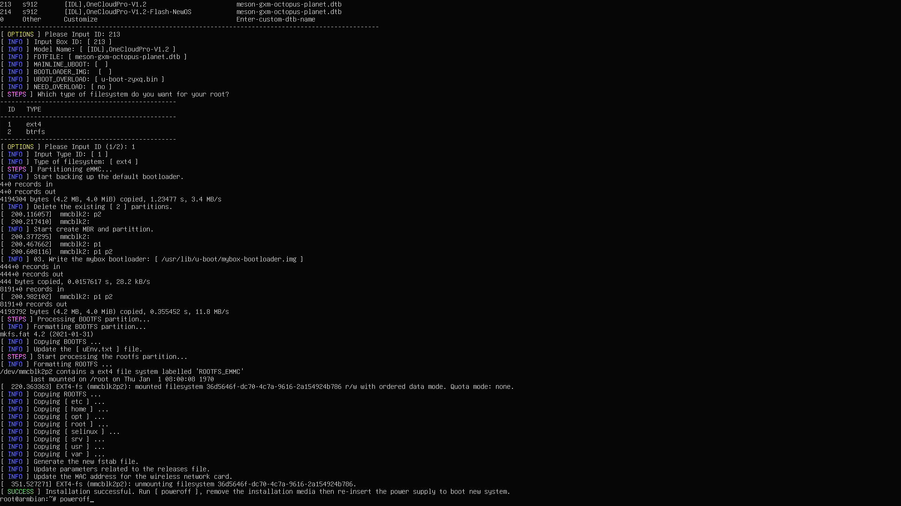
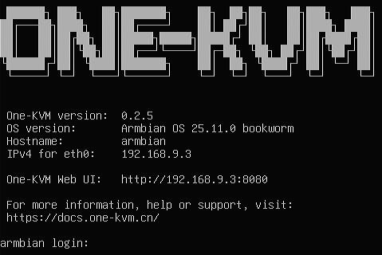

玩客云 Pro 采用了 S912 八核 CPU，搭配 2GB 内存和 8GB 内部储存空间。它配备了一个千兆网络接口、2个 USB 2.0接口，并提供 TF 卡槽和 HDMI 输出。

已有 Docker 和 DEB 软件包两种部署方式，两者操作较为简单。若选择整合包部署方式，需要[赞助](../other/thanks.md)作者并联系作者获取镜像。

## 整合包部署

1. **准备 SD 卡启动介质**：将 One-KVM 整合包写入 SD 卡，再将 SD 卡插入玩客云 Pro 的卡槽。
2. **从 SD 卡引导**：在原厂系统下首次刷机时，先按住 Reset 按钮再接通电源；看到玩客云 Logo 消失后，松开 Reset 按钮。之后如需再次刷机，接通电源即可自动启动 SD 卡中的系统。
3. **将系统安装至 eMMC**：SD 卡中的系统成功启动后，通过 One-KVM 网页终端或 SSH 登录终端，执行 `armbian-install`。选择与主板版本对应的型号：V1.1 主板选择 `201`，V1.2 主板选择 `213`。

下图为 `armbian-install` 安装过程：



## 使用说明

系统首次启动后，约有 4.6 GB 可用存储空间。

**硬件连接**

1. 将 USB HDMI 采集卡插入网口旁的普通 USB 接口，再使用 HDMI 线连接采集卡和被控机的 HDMI 输出接口。
2. 将 USB 双公线的一端插入二维码旁的 USB OTG 接口，另一端插入被控机的 USB 接口。
3. 确保所有连接稳固，再接入网线和电源。

!!! warning "硬件安全警告"

    为避免潜在风险（如被控设备无法正常启动或识别设备，甚至极少数情况下造成硬件损坏），强烈建议在使用 USB 双公线前采取以下任一安全措施：

    方案一：剪断或移除 USB 线中的红色 5V 电源线（VCC），仅保留数据线（D+/D−）和地线（GND），以切断供电路径；

    方案二：在 USB 链路中串接一个带独立电源开关的 USB HUB，并确保在连接时关闭其电源开关。

    部分低功耗设备可能在未通主电源的情况下，通过 USB OTG 接口从 KVM 设备反向取电，导致进入异常状态——即使后续接通主电源也可能无法正常启动。

    **除非您明确了解操作后果，否则请务必采用上述防护措施以保障设备安全。**

**HDMI 终端**

通过 HDMI 输出终端可以查看设备 IP 地址和软件版本。



**SSH 远程登录**

Armbian 系统默认开启 SSH 服务，初始用户名和密码为 `root` / `1234`。请尽快修改默认密码。

!!! warning "系统升级警告"
    不建议使用 `apt upgrade` 升级内核和设备树，可能会出现系统异常，OTG 功能无法使用。

**MAC 地址修改**

当前镜像通过 `/etc/one-kvm-image/eth0.mac` 持久化网卡 MAC 地址。SSH 登录设备后，执行以下命令：

```bash
mkdir -p /etc/one-kvm-image
echo '02:11:22:33:44:55' | tee /etc/one-kvm-image/eth0.mac
reboot
```

如需使用其他 MAC 地址，请替换示例中的 `02:11:22:33:44:55`。

**USB 功能组合**

| 组合 | 结果 |
| --- | --- |
| 键盘（含状态灯） + 相对鼠标 + 绝对鼠标 + 多媒体键 | 通过 |
| 键盘（含状态灯） + 相对鼠标 + 绝对鼠标 + 多媒体键 + MSD | 通过 |
| 键盘（含状态灯） + 相对鼠标 + 绝对鼠标 + 多媒体键 + MSD + NCM/ECM | 不支持 |
| 键盘（含状态灯） + 相对鼠标 + 绝对鼠标 + 多媒体键 + RNDIS | 不支持 |
| 键盘（含状态灯） + 相对鼠标 + 绝对鼠标 + 多媒体键 + MSD + RNDIS | 不支持 |
| 键盘（含状态灯） + 相对鼠标 + 绝对鼠标 + RNDIS | 通过 |
| 键盘（含状态灯） + 相对鼠标 + 绝对鼠标 + MSD + RNDIS | 不支持 |
| 键盘（含状态灯） + 相对鼠标 + 绝对鼠标 + MSD + NCM/ECM | 通过 |

## 性能测试报告

- 运行编号：`20260722-222014-7f19dd`
- 测试设备：玩客云 Pro（onecloud-pro）
- 视频设备：`/dev/video1`（1080p@50fps MJPEG、1080p@10fps YUYV）
- HID 设备：OTG
- HTTP 延迟：p50=3.1ms，p95=3.8ms，max=4.0ms

### 视频性能

| 视频输入参数              | 测试帧率 | 延迟统计（中位数 p50 / 95%分位 p95 / 最大值 max） |
| ------------------------- | -------- | ------------------------------------------------- |
| 1080p@50fps MJPEG → MJPEG | 50fps    | p50=76.0ms，p95=94.2ms，max=97.1ms            |
| 1080p@50fps MJPEG → H.264 | 25.2fps  | p50=298.7ms，p95=319.8ms，max=323.2ms         |
| 1080p@50fps MJPEG → H.265 | 3.9fps   | p50=779.9ms，p95=858.5ms，max=867.1ms         |
| 1080p@10fps YUYV → MJPEG  | 9.5fps   | p50=326.5ms，p95=368.4ms，max=378.4ms         |
| 1080p@10fps YUYV → H.264  | 9.5fps   | p50=635.2ms，p95=702.1ms，max=718.0ms         |
| 1080p@10fps YUYV → H.265  | 2.7fps   | p50=1391.4ms，p95=2091.3ms，max=2259.4ms      |

### HID 性能

| 输入方式 | 延迟统计（中位数 p50 / 95%分位 p95 / 最大值 max） |
| -------- | ------------------------------------------------- |
| OTG      | p50=2.6ms，p95=3.0ms，max=3.0ms                   |

### MSD 性能

| 操作 | 数据       |
| ---- | ---------- |
| 写   | 10.03 MiB/s |
| 读   | 14.59 MiB/s |
