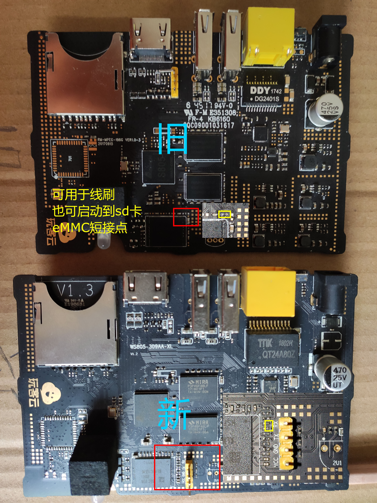
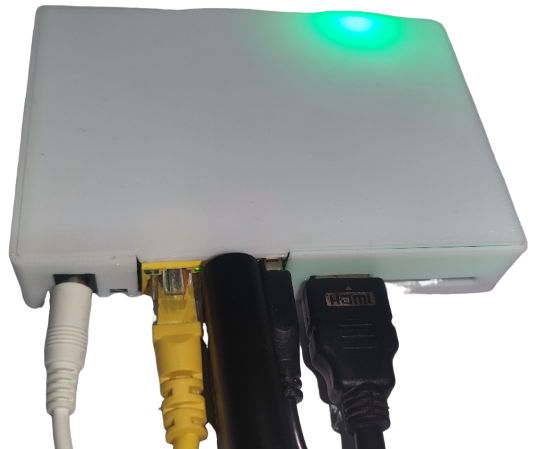
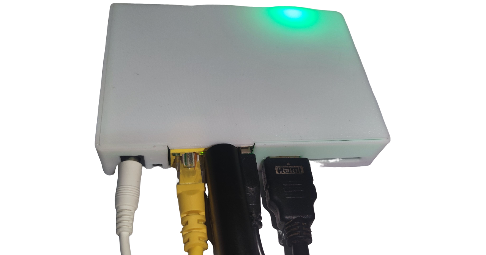
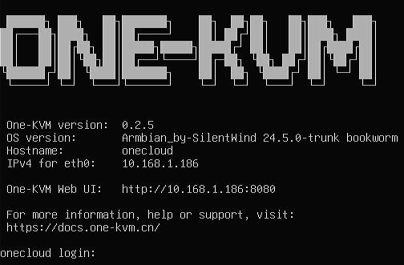
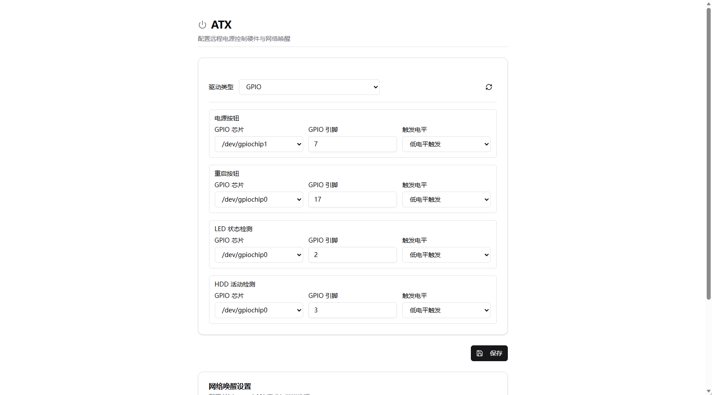
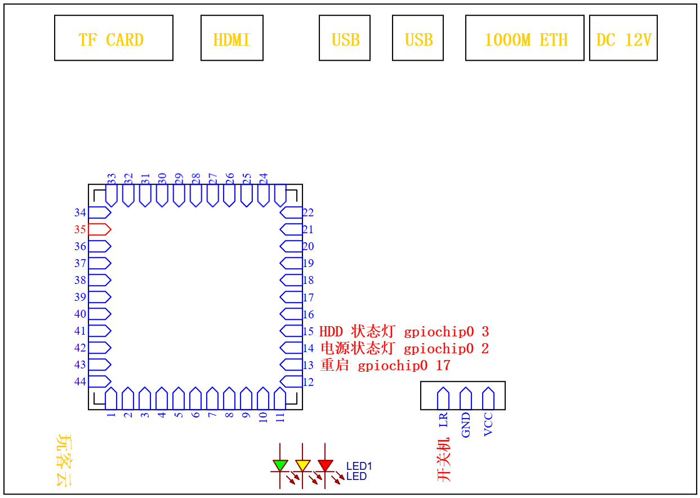
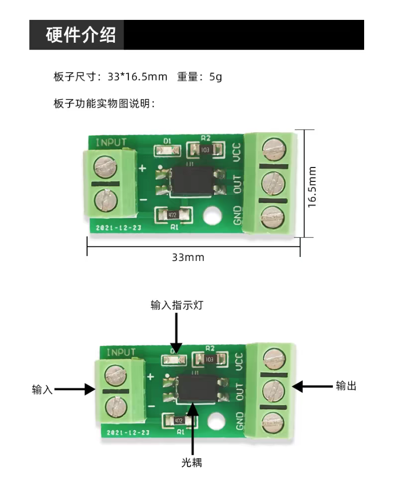
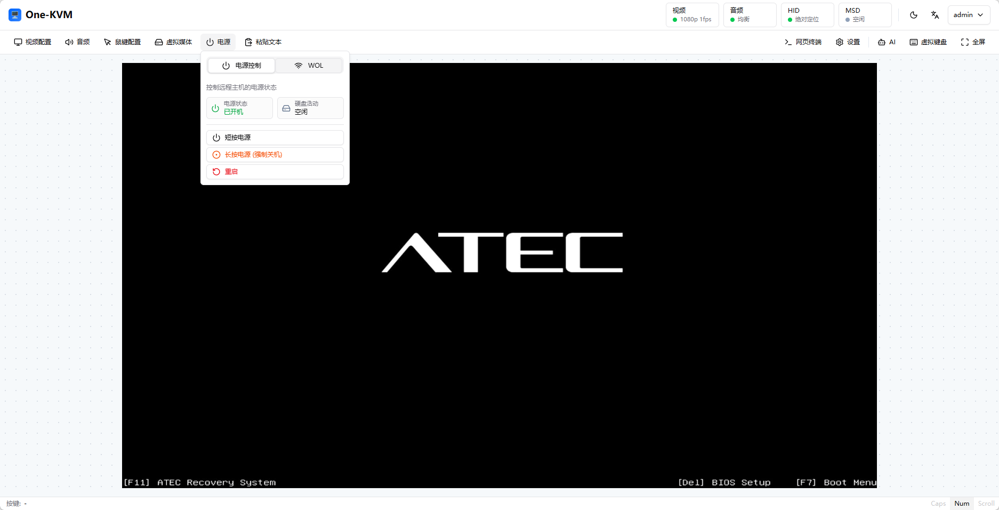

已有 Docker 和 DEB 软件包两种部署方式，两者操作较为简单。若选择整合包部署方式，需要[赞助](../other/thanks.md)作者并联系作者获取镜像。

## 整合包介绍

玩客云最新整合包名称如下：

- One-KVM-RUST_by-SilentWind_Onecloud_v0.2.6_260803-da20d8b.burn.img.xz

优势：

- 应用了 PiKVM MSD 内核补丁，支持大于 2.2G 的 ISO 挂载和虚拟媒体设备名称自定义；
- Linux 内核版本为 6.12.x，对启动参数进行特别调优，运行更稳定。

相较于老旧的 5.9 内核，最新 6.12.x 内核镜像的各 OTG 功能模块更加完善，切换OTG功能时不会触发内核模块崩溃。

## 整合包部署

**刷机事项**
线刷镜像（带 burn 后缀）适用于通过 Amlogic USB Burning Tool 进行固件更新。推荐使用 v2.1.3 或更低版本的刷机软件。

刷机短接时不需要一直短接，在烧录软件识别到并加载到 1% 可以松手耐心等待刷机成功了。玩客云主板刷机短接图片来源于玩客云技术交流群 蓝蓝大佬。



玩客云刷入直刷镜像后默认上网方式为 DHCP 自动获取 IP，主机名为 `onecloud`。启动时由玩客云前面板LED灯会有红灯转为绿灯，启动后在浏览器访问玩客云IP即可。



若还需要刷机，不需要再次进行短接了，可以按住重置键通电进入刷机模式。

## 使用说明

系统首次启动后，约有 5.9 GB 可用存储空间。

**硬件连接**

1. 将 HDMI 转 USB 采集卡插入玩客云主机靠近网口的 USB 插槽，使用 HDMI 视频线连接采集卡与被控机器的 HDMI 输出端。
2. 将 USB 双公线的一端插入玩客云主机 HDMI 接口旁边的 USB 插槽，另一端连接至被控机器相应的 USB 接口。
3. 确保所有连接稳固，接入电源及网线。

!!! warning "硬件安全警告"

    为避免潜在风险（如被控设备无法正常启动或识别设备，甚至极少数情况下造成硬件损坏），强烈建议在使用 USB 双公线前采取以下任一安全措施：

    方案一：剪断或移除 USB 线中的红色 5V 电源线（VCC），仅保留数据线（D+/D−）和地线（GND），以切断供电路径；

    方案二：在 USB 链路中串接一个带独立电源开关的 USB HUB，并确保在连接时关闭其电源开关。

    部分低功耗设备可能在未通主电源的情况下，通过 USB OTG 接口从 KVM 设备反向取电，导致进入异常状态——即使后续接通主电源也可能无法正常启动。
    
    **除非您明确了解操作后果，否则请务必采用上述防护措施以保障设备安全。**



**HDMI 终端**

通过 HDMI 输出终端可以查看设备 IP 地址和软件版本。



**SSH 远程登录**

Armbian 系统默认开启 SSH 服务，初始用户名和密码为 `root` / `1234`。请尽快修改默认密码。

!!! warning "系统升级警告"
    不建议使用 `apt upgrade` 升级内核和设备树，可能会出现系统异常，OTG 功能无法使用。

**MAC 地址修改**

当前镜像通过 `/etc/one-kvm-image/eth0.mac` 持久化网卡 MAC 地址。SSH 登录设备后，执行以下命令：

```bash
mkdir -p /etc/one-kvm-image
echo '02:11:22:33:44:55' | tee /etc/one-kvm-image/eth0.mac
reboot
```

如需使用其他 MAC 地址，请替换示例中的 `02:11:22:33:44:55`。

**USB 功能组合**

| 组合 | 结果 |
| --- | --- |
| 键盘（含状态灯） + 相对鼠标 + 绝对鼠标 + 多媒体键 | 通过 |
| 键盘（含状态灯） + 相对鼠标 + 绝对鼠标 + 多媒体键 + MSD | 通过 |
| 键盘（含状态灯） + 相对鼠标 + 绝对鼠标 + 多媒体键 + MSD + NCM/ECM | 不支持 |
| 键盘（含状态灯） + 相对鼠标 + 绝对鼠标 + 多媒体键 + RNDIS | 不支持 |
| 键盘（含状态灯） + 相对鼠标 + 绝对鼠标 + 多媒体键 + MSD + RNDIS | 不支持 |
| 键盘（含状态灯） + 相对鼠标 + 绝对鼠标 + RNDIS | 通过 |
| 键盘（含状态灯） + 相对鼠标 + 绝对鼠标 + MSD + RNDIS | 不支持 |
| 键盘（含状态灯） + 相对鼠标 + 绝对鼠标 + MSD + NCM/ECM | 通过 |

### ATX 电源管理配置

这里提供一套适用于玩客云 ATX 配置，需要完成软件上的设置和硬件上的连线后才能正常使用。

#### 软件

设置页面填入如下 GPIO 引脚数据并保存。



#### 硬件

**电源动作**：

玩客云开机引脚连接电脑主板 9 Pin 中的 PWR SW+，GND 引脚连接主板 9 Pin 中的 PWR SW-。

玩客云重启引脚连接电脑主板 9 Pin 中的 RESET+，GND 引脚连接主板 9 Pin 中的 RESET-。

**电源状态**：

需要提前准备光耦隔离模块，相比于继电器模块更加推荐使用光耦隔离模块。

电脑主板 9 Pin 中的 POWER LED+ 和 POWER LED- 分别连接光耦隔离模块输入端的正极和负极（有严格对应关系），光耦隔离模块输出端的 GND和 OUT 分别玩客云的电源状态灯焊盘和 VCC 焊盘（无严格对应关系）。

电脑主板 9 Pin 中的 HDD LED+ 和 HDD LED- 分别连接光耦隔离模块输入端的正极和负极（有严格对应关系），光耦隔离模块输出端的 GND 和 OUT 分别玩客云的 HDD 状态灯焊盘和 VCC 焊盘（无严格对应关系）。





#### 效果



## 性能测试报告

测试用整合包： One-KVM-RUST_by-SilentWind_Onecloud_v0.2.5_260722-da20d8b.img.xz 

- 运行编号：`20260705-201140-9f9676`
- 测试设备：玩客云（onecloud）
- 视频设备：`/dev/video0`（1080p@50fps MJPEG、1080p@10fps YUYV）
- HID 设备：OTG
- HTTP 延迟：p50=2.8ms，p95=3.1ms，max=3.2ms

### 视频性能

| 视频输入参数              | 测试帧率 | 延迟统计（中位数 p50 / 95%分位 p95 / 最大值 max）            |
| ------------------------- | -------- | ------------------------------------------------------------ |
| 1080p@50fps MJPEG → MJPEG | 49.9fps  | p50=71.6ms，p95=80.9ms，max=83.0ms                       |
| 1080p@50fps MJPEG → H.264 | 14.8fps  | p50=422.9ms，p95=439.3ms，max=442.3ms                    |
| 1080p@50fps MJPEG → H.265 | 4.6fps   | p50=1791.8ms，p95=2341.0ms，max=2442.7ms                 |
| 1080p@10fps YUYV → MJPEG  | 10fps    | p50=383.7ms，p95=415.7ms，max=423.1ms                    |
| 1080p@10fps YUYV → H.264  | 9.9fps   | p50=670.4ms，p95=710.8ms，max=712.0ms                    |
| 1080p@10fps YUYV → H.265  | 1.7fps   | 失败                                                     |

### HID 性能

| 输入方式 | 延迟统计（中位数 p50 / 95%分位 p95 / 最大值 max） |
| -------- | ------------------------------------------------- |
| OTG      | p50=5.7ms，p95=5.9ms，max=5.9ms                   |

### MSD 性能

| 操作 | 数据       |
| ---- | ---------- |
| 写   | 11.38 MiB/s |
| 读   | 14.64 MiB/s |
