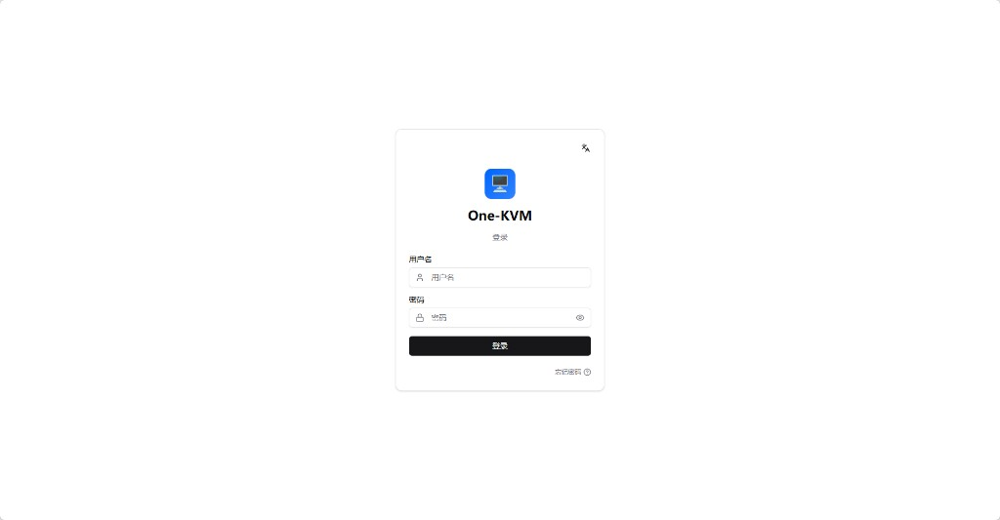
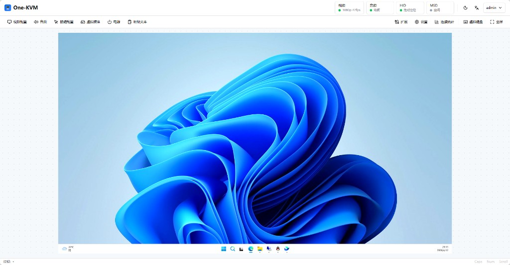
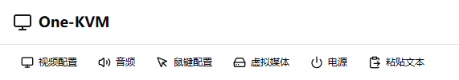
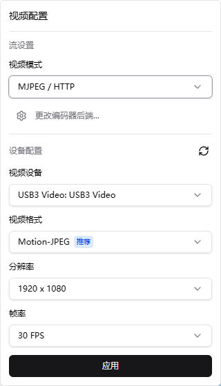
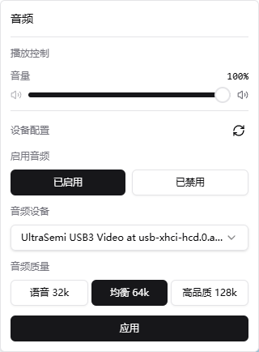
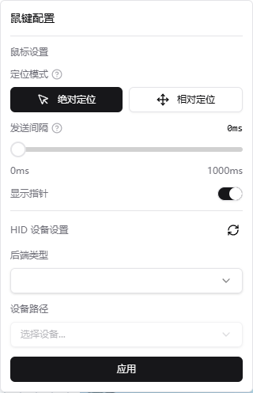
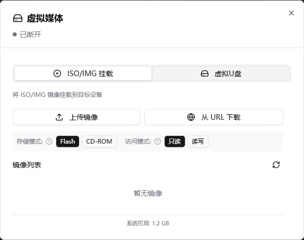
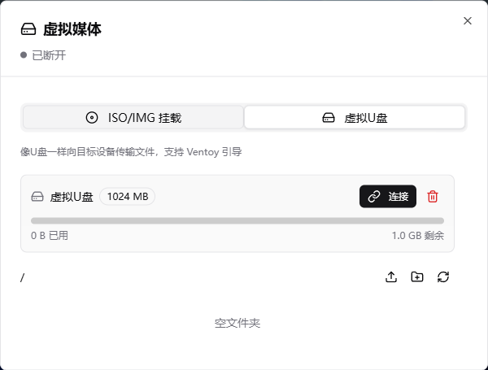
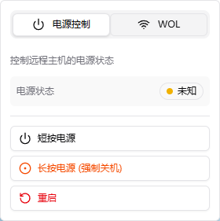

# 控制台

控制台是 One-KVM 的核心界面，提供实时的远程控制功能。

## 登录

登录后进入控制台页面。

## 界面概览

控制台页面主要分为状态栏、工具栏、视频窗口三个区域。

## 工具栏

工具栏提供了常用的控制功能：

### 视频控制

One-KVM 支持两种视频流模式：

=== "WebRTC 模式"

    - H.264/H.265/VP8/VP9 编码，低带宽占用
    - 需要现代浏览器

=== "MJPEG 模式"

    - 兼容性好

### 音频控制

### 鼠键控制

One-KVM 支持两种鼠标模式：

=== "绝对模式"

    - 鼠标位置与目标屏幕一一对应，无需捕获鼠标；
    - 推荐用于 Windows 图形界面。

=== "相对模式"

    - 发送鼠标移动量，需要点击锁定鼠标；
    - 用于不支持绝对鼠标的系统（如安卓系统）。

### 虚拟媒体

### 电源控制

