# 设置页面

设置页面允许您配置 One-KVM 的各项功能。

## 访问设置

点击界面右上角的齿轮图标 :material-cog: 进入设置页面。

## 通用

### 外观

设置 Web 界面的主题模式与显示语言。

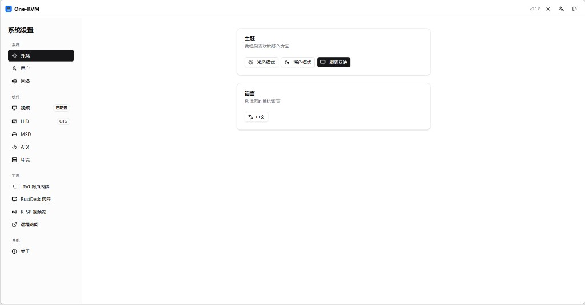

### 用户

管理登录用户名与密码，以及是否允许多个 Web 会话同时在线（关闭后新登录会断开已有会话）。

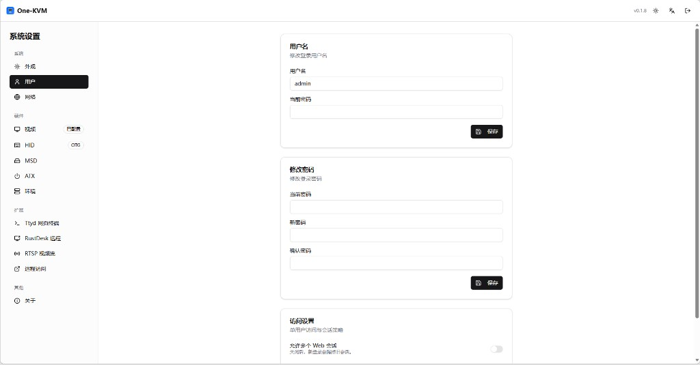

### 网络

配置 Web 服务监听端口、HTTPS/HTTP、监听地址与 TLS 证书。

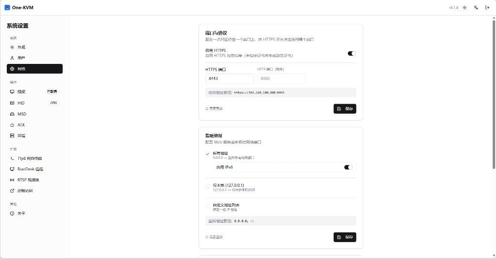

## 硬件

### 视频设置

选择视频采集设备、格式、分辨率与帧率，并设置 WebRTC 编码后端及 STUN/TURN。

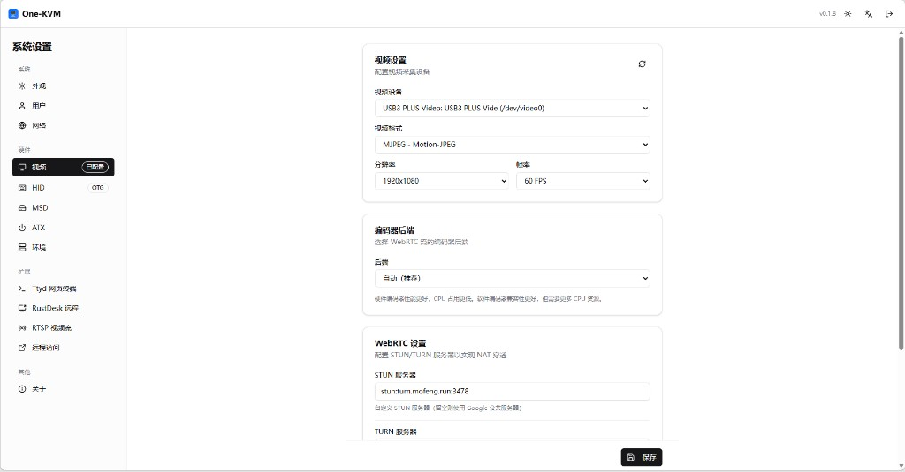

### HID 设置

配置键鼠 HID 后端，以及向被控机暴露的 HID 功能组合。

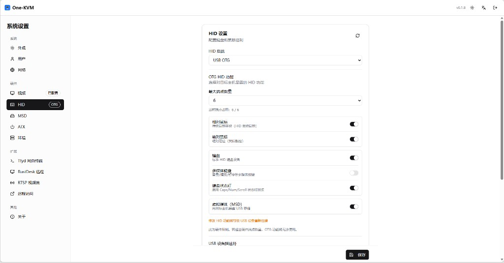

### MSD 设置

指定虚拟媒体（ISO 等）存储根目录，并查看 MSD 服务状态。

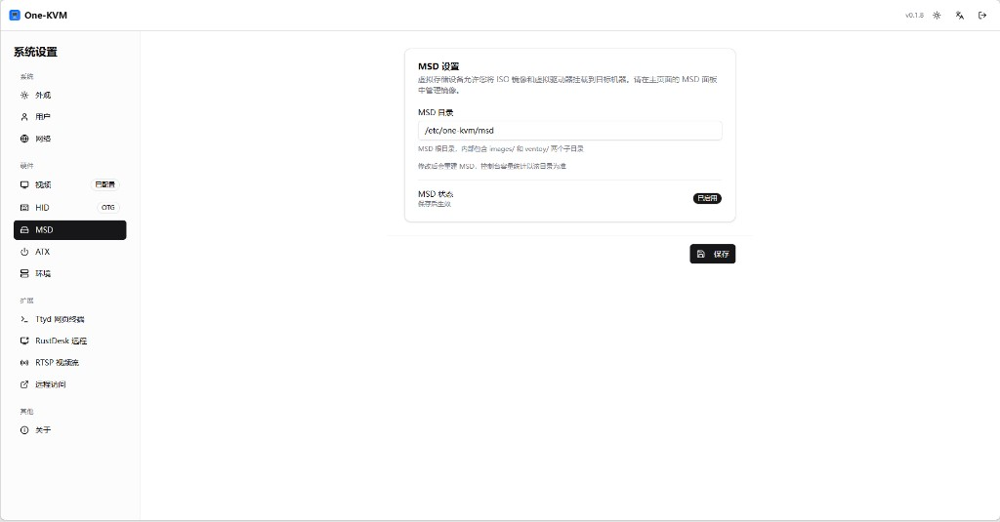

### ATX 设置

为开关机、重启键及可选的电源灯检测绑定 GPIO 或 USB 继电器等驱动。

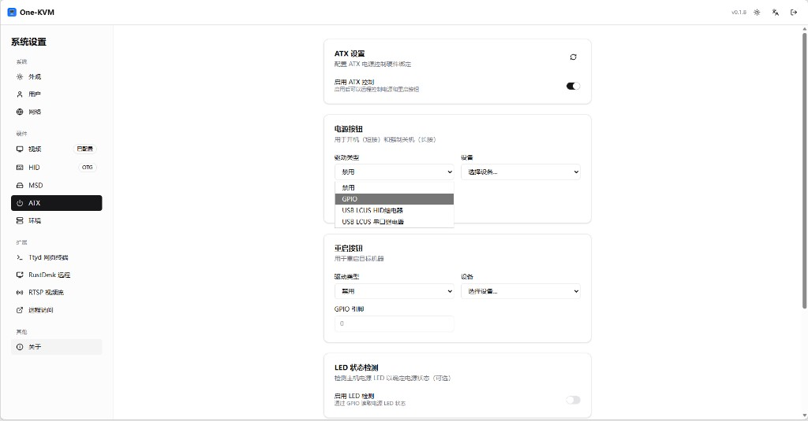

### 环境

运行诊断工具，检查 USB OTG / gadget 链路与硬件视频编码能力。

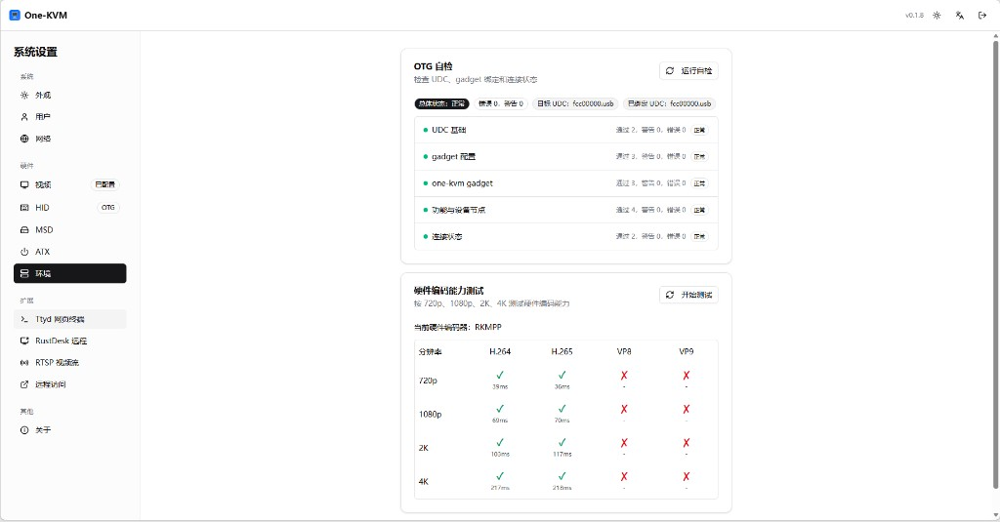

## 扩展

### RustDesk 远程

对接 RustDesk 服务器，可通过 RustDesk 应用远程访问控制 。

### Ttyd 网页终端

通过 ttyd 在浏览器中打开本机 Shell，可配置默认 Shell 与自启等行为。

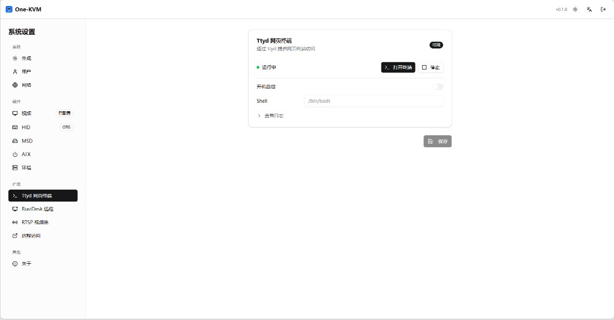

### RTSP 视频流

将当前视频以 RTSP 推出，可设置监听地址、端口、路径、编码格式与访问认证。

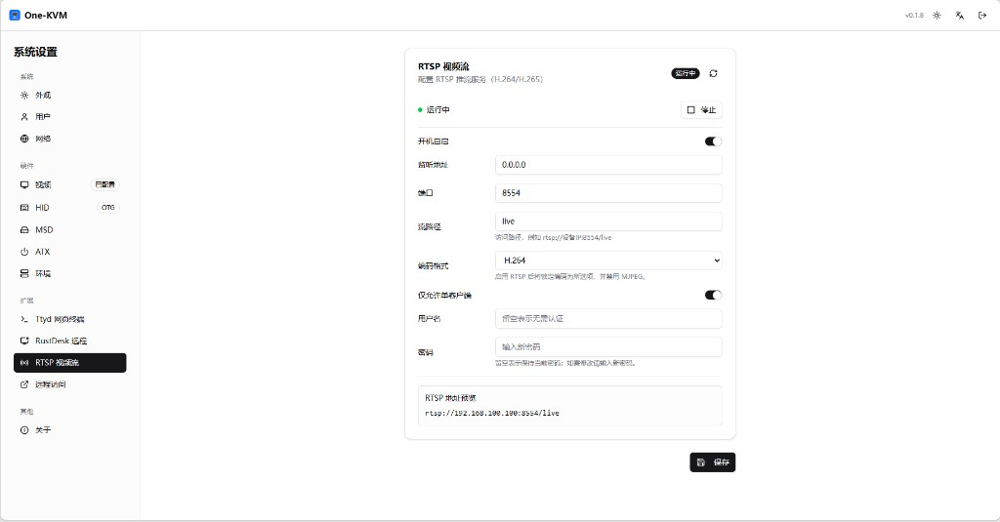

### 远程访问

可在此页面配置 GOSTC 内网穿透与 EasyTier P2P 异地组网。

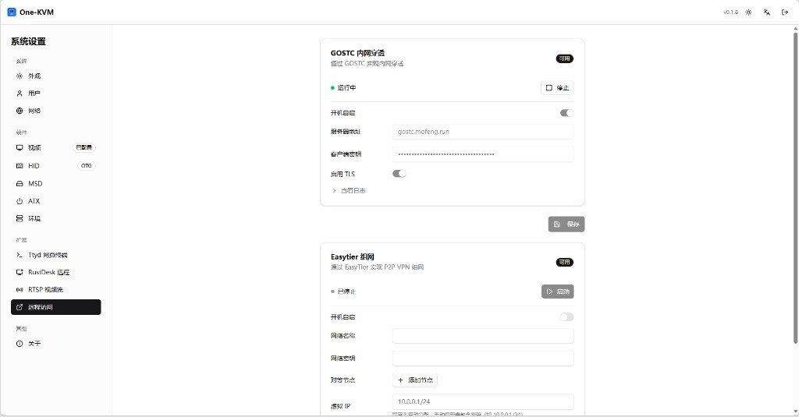

## 系统

### 关于

查看在线升级通道与版本信息，以及主机名、CPU/内存占用和网络地址等设备概况。

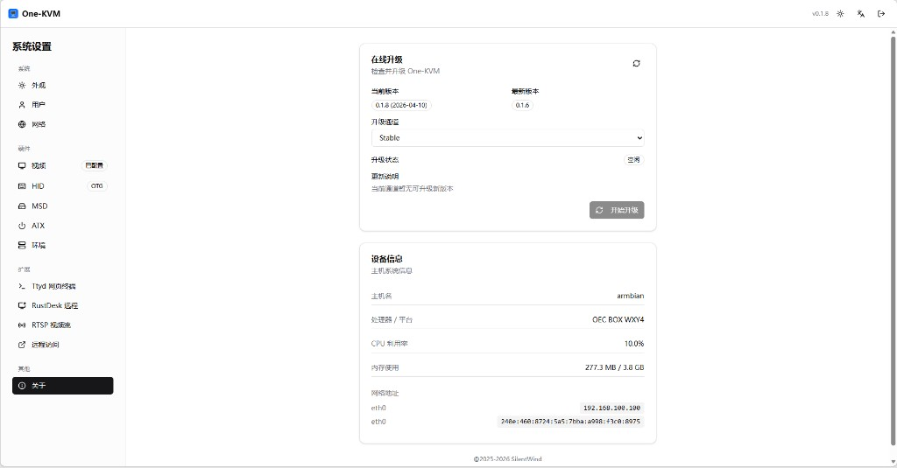
